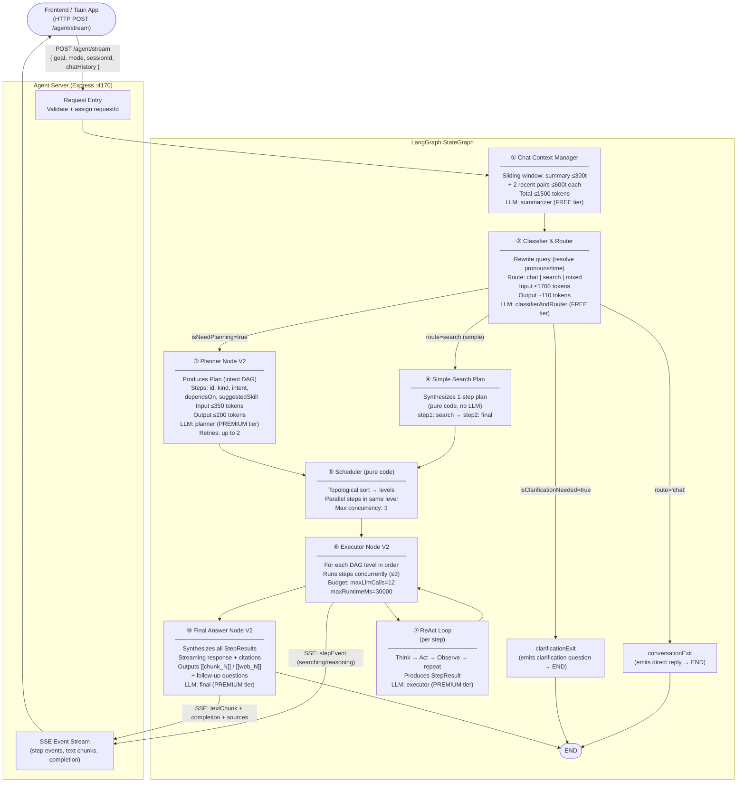

# Agent Architecture — Memento Search Engine

> **Scope:** Agentic pipeline only. Does not cover chat storage or database persistence.

---

## Table of Contents

1. [System Overview](#system-overview)
2. [Architecture Diagram (Mermaid)](#architecture-diagram)
3. [Pipeline Nodes — Detailed Breakdown](#pipeline-nodes)
   - [Chat Context Manager](#1-chat-context-manager)
   - [Classifier & Router Node](#2-classifier--router-node)
   - [Planner Node V2](#3-planner-node-v2)
   - [Simple Search Plan](#4-simple-search-plan-no-planner)
   - [Scheduler](#5-scheduler)
   - [Executor Node V2](#6-executor-node-v2)
   - [ReAct Loop (Step Executor)](#7-react-loop-step-executor)
   - [Final Answer Node V2](#8-final-answer-node-v2)
4. [Data Sources & RAG System](#data-sources--rag-system)
5. [Skills](#skills)
6. [Tools](#tools)
7. [Token Budget Allocation](#token-budget-allocation)
8. [LLM Roles & Model Tiers](#llm-roles--model-tiers)
9. [Search Modes](#search-modes)
10. [API Exposure](#api-exposure)

---

## System Overview

The agent is a **LangGraph StateGraph** pipeline that receives a natural language query,
routes it, optionally plans a multi-step DAG, executes each step via a ReAct loop
against a local SQLite screen-capture database + optional web search, and synthesizes
a streaming final answer.

**Framework:** [LangGraph](https://github.com/langchain-ai/langgraph) (`@langchain/langgraph`)  
**LLM Gateway:** Internal AI gateway (`ai-gateway` service) — proxies to cloud LLMs  
**Data store:** Local SQLite with FTS5 + vector embeddings (served by Rust `daemon` crate)  
**Transport:** HTTP SSE (Server-Sent Events) — streaming responses  
**Exposed by:** `app/agents/src/server.ts` — Express HTTP server on port `4170` (preferred range `4170–4177`)

---

## Architecture Diagram



---

## Pipeline Nodes

### 1. Chat Context Manager

**File:** `app/agents/src/chatContextManager.ts`  
**LLM Role:** `summarizer` (FREE tier)  
**When called:** Every request, first node in the graph

**What it does:**
- Receives raw `chatHistory[]` (unbounded)
- Applies a **sliding window with summarization** to produce a bounded `chatContext` string
- Structure of output context (hard cap: **1500 tokens total**):
  - `summary` ≤ 300 tokens — compressed older history (LLM-generated, only fires when raw pairs > 1200 tokens)
  - `pair[-2]` ≤ 600 tokens — second most-recent user+assistant exchange
  - `pair[-1]` ≤ 600 tokens — most recent exchange
- The `chatContext` string is passed downstream to every node that needs conversational awareness

**State outputs:**
- `chatContext` (string, ≤1500 tokens)
- `chatContextTokens` (number)

---

### 2. Classifier & Router Node

**File:** `app/agents/src/classifierAndRouterNode.ts`  
**LLM Role:** `classifierAndRouter` (FREE tier)  
**Input budget:** ≤1700 tokens (system ~100 + chatContext ≤1500 + query ~100)  
**Output:** ~110 tokens

**What it does in a single LLM call:**
1. **Rewrites the query** — resolves pronouns (`it`, `that`, `this`), relative time (`yesterday`, `last week` → ISO timestamps), and vague references to explicit entities
2. **Routes** the query to one of three paths:
   - `chat` — fully answerable from conversation context, **no data retrieval** needed
   - `search` — requires querying the screen history database
   - `mixed` — references prior chat AND needs new data retrieval

**Clarification detection:** If the query is too ambiguous to proceed, sets `isClarificationNeeded = true` and writes `clarificationQuestion`.

**Routing logic (graph edges):**
```
isClarificationNeeded=true  →  clarificationExit (END)
route='chat'                →  conversationExit (END)
isNeedPlanning=true         →  planner
else                        →  simpleSearchPlan
```

**State outputs:** `rewrittenQuery`, `route`, `isClarificationNeeded`, `clarificationQuestion`, `conversationResponse`, `isNeedPlanning`

---

### 3. Planner Node V2

**File:** `app/agents/src/planner/planner.nodeV2.ts`  
**LLM Role:** `planner` (PREMIUM tier)  
**Input budget:** ≤350 tokens  
**Output budget:** ≤200 tokens  
**Retries:** Up to 2 (configurable via `maxPlanRetries`)

**What it does:**
- Receives `rewrittenQuery` + summaries of available **skills** and **tools** (from `skillContext.ts`)
- Produces a **Plan** — a validated intent DAG:
  ```json
  {
    "goal": "user's original goal",
    "steps": [
      {
        "id": "step1",
        "kind": "search",
        "stepGoal": "find X",
        "intent": "rewritten sub-query",
        "dependsOn": [],
        "suggestedSkill": "hybrid-search"
      },
      {
        "id": "step2",
        "kind": "final",
        "stepGoal": "synthesize answer",
        "intent": "answer the question",
        "dependsOn": ["step1"]
      }
    ]
  }
  ```
- The plan passes through `validatePlan()` — checks for cycles, missing deps, valid step kinds
- On validation failure, retries with refined prompt (up to `maxPlanRetries`)
- Planner context is **cached** after first load (skills + schema do not change per-request)

**State outputs:** `plan`, `planAttempts`

---

### 4. Simple Search Plan (No Planner)

**File:** `app/agents/src/agent.ts` (`simpleSearchPlan` function)  
**LLM used:** None (pure code)

**What it does:**
- A lightweight fast-path for simple queries that don't need multi-step planning
- Synthesizes a hardcoded 2-step plan:
  - `step1 (search)` → find relevant information
  - `step2 (final)` → synthesize answer
- Wires directly into the Executor without any LLM overhead

---

### 5. Scheduler

**File:** `app/agents/src/scheduler/scheduler.ts`  
**LLM used:** None (pure code)

**What it does:**
- Takes the validated `Plan` and performs a **topological sort** into execution levels (DAG levels)
- Steps at the same level have no dependency on each other → can run **in parallel**
- Steps at higher levels wait for all their dependencies to complete
- Output: `ExecutionSchedule { levels: PlanStep[][] }`

**Example:**
```
Level 0: [step1, step2]     ← both independent, run concurrently
Level 1: [step3]             ← depends on step1 and step2
Level 2: [step4 (final)]    ← depends on step3
```

---

### 6. Executor Node V2

**File:** `app/agents/src/executor/executor.nodeV2.ts`  
**LLM used:** None directly (delegates to ReAct loop per step)

**What it does:**
- Iterates through each **schedule level** in order
- Within a level, runs steps with **max concurrency = 3** using `Promise.allSettled`
- Tracks global budgets:
  - `maxLlmCalls = 12` — total LLM calls across all steps
  - `maxRuntimeMs = 30000` — total wall-clock time budget (30 sec)
- For each step, builds **DAG-scoped dependency context**:
  - **Direct dependencies** → receive full `StepResult` object
  - **Transitive ancestors** → receive one-line brief via `buildStepBrief()`
- Skips `kind: "final"` steps (handled by `finalAnswer` node)
- Emits SSE step events (`searching` / `reasoning` / `failed`) for real-time UI updates

**State outputs:** `stepResults` (accumulated `Record<stepId, StepResult>`)

---

### 7. ReAct Loop (Step Executor)

**Files:** `app/agents/src/executor/react.node.ts`, `app/agents/src/skills/reactExecutor.ts`  
**LLM Role:** `executor` (PREMIUM tier)

**What it does:**
Each plan step runs its own **ReAct (Reason + Act) loop**:
```
[Think] → pick action
[Act]   → execute tool
[Observe] → receive result
repeat until "done" action or turn limit reached
```

**Available actions the LLM can take:**

| Action | Tool Used | Description |
|---|---|---|
| `sql` | `sql_execute` | Write and run a SELECT/WITH SQL query against the screen database (FTS, aggregations, temporal) |
| `semantic` | `semantic_search` | Vector similarity search via embedding endpoint |
| `hybrid` | `hybrid_search` | Combined FTS keyword + semantic search |
| `webSearch` | `web_search` | Public web search via AI gateway `/v1/search` |
| `readMore` | `getSearchResultsByChunkIds` | Fetch full text of specific chunk IDs (preview-first pattern) |
| `getStepResult` | internal | Reference a completed step's result by ID |
| `currentDateTime` | internal | Get current local ISO timestamp |
| `think` | none | Internal reasoning step; no tool call, no observation |
| `done` | none | Finalize step; emit StepResult with summary, evidence, gaps, confidence |

**Skill aliases** (LLM may output skill name → normalized to action):

| Skill Name | Mapped Action |
|---|---|
| `aggregation-digest` | `sql` |
| `fts-search` | `sql` |
| `temporal-query` | `sql` |
| `semantic-search` | `semantic` |
| `hybrid-search` | `hybrid` |
| `web-search` | `webSearch` |

**Preview-first retrieval:**
Search results return truncated `text_content` (~150 chars). The agent uses `readMore` to fetch full text for promising chunks only. This prevents blowing the context window with irrelevant full documents.

**StepResult contract** (output of each step):
```typescript
{
  stepId:          string,
  goal:            string,
  status:          "complete" | "partial" | "empty",
  summary:         string,           // ≤300 tokens
  evidenceChunkIds: number[],        // [[chunk_N]] citation IDs
  evidence:        EvidenceItem[],   // { chunk_id, whatItIsAbout, source_type, url?, title? }
  gaps:            string[],
  searchesPerformed: SearchPerformed[],
  chunksRead:      number[],
  confidence:      "high" | "medium" | "low"
}
```

**Per-step turn limits by mode:**

| Mode | Max Turns | Max Searches | Max readMore chunks | Max results/search |
|---|---|---|---|---|
| `search` | 4 | 3 | 3 | 10 |
| `accurateSearch` | 8 | 7 | 6 | 20 |

---

### 8. Final Answer Node V2

**File:** `app/agents/src/finalLlm/finalAnswer.nodeV2.ts`  
**LLM Role:** `final` (PREMIUM tier)  
**Output budget:** ≤500 tokens  
**Streaming:** Yes (emits text chunks via SSE)

**What it does:**
- Collects all `StepResult` objects from `stepResults`
- Fetches full chunk content from the daemon for all `evidenceChunkIds` via `getSearchResultsByChunkIds`
- Formats step summaries + evidence into a context block
- Calls final LLM with **streaming** enabled — text chunks emitted via SSE as they arrive
- Citation format:
  - Memory chunks: `[[chunk_42]]`
  - Web results: `[[web_1]]`
- Parses `<FOLLOWUPS_JSON>` tag from response to extract suggested follow-up questions (0–3)
- Emits final `sources` event with resolved chunk metadata for the frontend to render inline cards

**What it emits over SSE:**
1. `stepEvent` (from executor) — real-time step status
2. `textChunk` — streaming answer tokens
3. `sources` — array of resolved source metadata (app, title, url, preview, timestamp)
4. `completion` — final full answer + followups

---

## Data Sources & RAG System

### Local Screen Memory Database (Primary)

Stored in a local **SQLite** database, populated continuously by the Rust `core` crate (screen capture daemon).

| Table | Contents |
|---|---|
| `frames` | One row per screen capture: `app_name`, `window_title`, `browser_url`, `captured_at`, `image_path` |
| `chunks` | OCR-extracted text segments from frames: `text_content`, `text_json` (position data) |
| `chunks_fts` | FTS5 virtual table over `chunks.text_content` — full-text keyword search |
| `vec_chunks` | 384-dim vector embeddings per chunk — semantic similarity search |

**Access pattern:**
- SQL queries → executed directly against local SQLite via `executeSql()` (read-only SELECT/WITH only)
- Semantic search → HTTP POST to Rust daemon endpoint (resolves via port file `memento-core.port`)
- Hybrid search → HTTP POST to Rust daemon hybrid endpoint (merges FTS5 + vector results, deduped by `chunk_id`)

### Public Web (Secondary)

- Accessed via `web_search` action → HTTP POST to `ai-gateway /v1/search`
- Used **only** when user explicitly asks for external info, or when local memory is insufficient
- Web results assigned **negative `chunk_id`** values to distinguish from local memory chunks
- Cited as `[[web_N]]` in final answer

---

## Skills

Skills are **Markdown instruction files** (`.skill.md`) loaded at startup by `skills/loader.ts`. They provide structured prompts, SQL patterns, and usage guidelines injected into the ReAct loop's system prompt and the planner's context.

| Skill | File | Tools Used | Purpose |
|---|---|---|---|
| `fts-search` | `fts-search.skill.md` | `sql_execute` | FTS5 keyword search — exact phrases, error messages, code snippets |
| `semantic-search` | `semantic-search.skill.md` | `semantic_search` | Embedding-based meaning search — conceptual queries |
| `hybrid-search` | `hybrid-search.skill.md` | `sql_execute`, `semantic_search` | Combined FTS + semantic — default for most queries |
| `temporal-query` | `temporal-query.skill.md` | `sql_execute` | Time-bounded SQL queries — "what did I do yesterday" |
| `aggregation-digest` | `aggregation-digest.skill.md` | `sql_execute` | Count/aggregate queries — "how much time on VS Code" |
| `web-search` | `web-search.skill.md` | `web_search` | Public web search — external/current information only |
| `multi-step-reasoning` | `multi-step-reasoning.skill.md` | all | Guides multi-step plans and inter-step reasoning |
| `database-schema` | `schema.skill.md` | — | Injected into SQL-generating prompts as schema reference |
| `skill-selection` | `skill-selection.skill.md` | — | Helps the planner pick the right skill per step |

**How skills are used:**
- **Planner:** Receives skill summaries (name + description + "When to Use") to annotate each step with `suggestedSkill`
- **ReAct Executor:** Full skill content is injected into the executor system prompt per step, based on the step's `suggestedSkill` field

---

## Tools

Tools are TypeScript classes registered in `tools/registry.ts`. All tools support **result caching** (in-memory LRU per tool).

| Tool | Class | Registered Name | Exposes | Notes |
|---|---|---|---|---|
| SQL Execute | `SqlExecuteTool` | `sql_execute` | Local SQLite | SELECT / WITH CTEs only. Validates before execution. Cached. |
| Semantic Search | `SemanticSearchTool` | `semantic_search` | Daemon HTTP endpoint | Vector similarity via daemon. Supports filters (app_names, time_range). Cached. |
| Hybrid Search | `HybridSearchTool` | `hybrid_search` | Daemon HTTP endpoint | Merges FTS + semantic results deduplicated by `chunk_id`. Cached. |
| Web Search | `WebSearchTool` | `web_search` | AI Gateway `/v1/search` | Public web. Forwards auth headers. Cached. |
| Get Chunk by ID | `getSearchResultsByChunkIds` | internal | Local SQLite | Fetches full text content for cited chunk IDs. Used by final node. |

---

## Token Budget Allocation

Every LLM call has a hard token ceiling enforced before invocation.

### Chat Context Manager

| Component | Budget |
|---|---|
| Summary (older history) | ≤ 300 tokens |
| Recent pair [-2] | ≤ 600 tokens |
| Recent pair [-1] | ≤ 600 tokens |
| **Total chat context** | **≤ 1500 tokens** |
| Summarization trigger | Raw pairs > 1200 tokens |

### Classifier & Router Node

| Component | Budget |
|---|---|
| System prompt | ~100 tokens |
| Chat context input | ≤ 1500 tokens |
| User query | ≤ 100 tokens |
| **Total input** | **≤ 1700 tokens** |
| Output | ~110 tokens |

### Planner Node

| Component | Budget |
|---|---|
| System prompt | ~100 tokens |
| Rewritten query | ≤ 100 tokens |
| Skill summaries | ≤ 100 tokens |
| Tool references | ≤ 50 tokens |
| **Total input** | **≤ 350 tokens** |
| Output (plan JSON) | ≤ 200 tokens |

### ReAct Loop (Per Step, Per Turn)

| Component | `search` mode | `accurateSearch` mode |
|---|---|---|
| Fixed context (system + skill + tool refs) | 200 tokens | 200 tokens |
| Evidence items (50 tokens × N) | 50 × 20 = 1000 | 50 × 40 = 2000 |
| Dependency context | 200 tokens | 200 tokens |
| Observation history (search previews) | 100t × 10 = 1000 | 100t × 20 = 2000 |
| **Worst-case total per turn** | **≤ 4400 tokens** | **≤ 16400 tokens** |

### Final Answer Node

| Component | `search` mode | `accurateSearch` mode |
|---|---|---|
| System prompt | ~100 tokens | ~100 tokens |
| Chat context | ≤ 1500 tokens | ≤ 1500 tokens |
| User query | ~100 tokens | ~100 tokens |
| Step outputs (4 × D) | 4800 tokens | 8800 tokens |
| **Total input** | **≤ 6500 tokens** | **≤ 10500 tokens** |
| Output (answer + followups) | ≤ 500 tokens | ≤ 500 tokens |

### Global Agent Budgets (Config)

| Setting | Value | Description |
|---|---|---|
| `maxLlmCalls` | 12 | Total LLM calls across all steps in one request |
| `maxRuntimeMs` | 30,000 ms | Wall-clock timeout for entire agentic run |
| `stepTimeoutMs` | 20,000 ms | Timeout per individual step |
| `maxPlanRetries` | 2 | Plan validation retry attempts |
| `previewLength` | 150 chars | Text preview truncation for search results |

---

## LLM Roles & Model Tiers

Roles are mapped to model tiers by the AI gateway. The agent never picks a model directly.

| Role | LLM Tier | Node | Rationale |
|---|---|---|---|
| `summarizer` | **FREE** | Chat Context Manager | Lightweight compression task |
| `classifierAndRouter` | **FREE** | Classifier & Router | Small output, well-structured task |
| `planner` | **PREMIUM** | Planner Node V2 | Complex DAG reasoning |
| `executor` | **PREMIUM** | ReAct Loop | Iterative tool-use decisions |
| `final` | **PREMIUM** | Final Answer Node | Synthesis + streaming |

**Auth forwarding:** All PREMIUM calls forward `Authorization` and `X-Device-ID` headers to the gateway for per-user credit tracking.

---

## Search Modes

Two modes are supported, selected per-request via the `mode` field in the API request.

| Capability | `search` (standard) | `accurateSearch` (thorough) |
|---|---|---|
| Max plan steps | 4 | 4 |
| Max ReAct turns per step | **4** | **8** |
| Max search calls per step | **3** | **7** |
| Max results per search | **10** | **20** |
| Max readMore chunks | **3** | **6** |
| Max evidence items | **20** | **40** |
| Input token budget (ReAct) | ≤ 4,400 | ≤ 16,400 |
| Input token budget (Final) | ≤ 6,500 | ≤ 10,500 |

---

## API Exposure

### Agent Server

**File:** `app/agents/src/server.ts`  
**Port:** `4170` (preferred; falls back within `4170–4177` range; port written to `memento-agents.port` file)  
**Host:** `127.0.0.1` (localhost only)  

### Endpoint: `POST /agent/stream`

**Request:**
```json
{
  "goal": "string (1–5000 chars)",
  "mode": "search" | "accurateSearch",
  "sessionId": "string (optional)",
  "chatHistory": [
    { "role": "user" | "assistant", "content": "string" }
  ]
}
```

**Response:** `text/event-stream` (SSE)

SSE Event types emitted during execution:

| Event Type | When | Payload |
|---|---|---|
| `stepEvent` | At each step start/end | `{ stepType, stepId, title, status, queries? }` |
| `textChunk` | During final LLM streaming | `{ text: string }` |
| `sources` | After final answer | Array of resolved source metadata |
| `completion` | End of request | `{ answer, followups }` |
| `error` | On failure | `{ message, code, fatal }` |

### Port Discovery

The agent server writes its bound port to:
- **Production:** `%PROGRAMDATA%\memento\ports\memento-agents.port`
- **Development:** User home-scoped memento dir

The frontend reads this port file to know where to connect.

---

## Flow Summary

```
User Query
    │
    ▼
① Chat Context Manager  (FREE LLM if summarization needed)
    │  chatContext ≤1500 tokens
    ▼
② Classifier & Router  (FREE LLM)
    │  rewrite query + decide route
    ├──[clarification needed]──► clarificationExit → SSE → END
    ├──[route=chat]─────────────► conversationExit → SSE → END
    ├──[complex, needs planning]► Planner ──────────────────┐
    └──[simple search]──────────► Simple Search Plan ───────┤
                                                            │
                                    ③/④ Plan (DAG)          │
                                                            ▼
                                    ⑤ Scheduler (topological sort)
                                            │  levels[]
                                            ▼
                                    ⑥ Executor Node
                                      for each level (parallel ≤3):
                                            │
                                            ▼
                                    ⑦ ReAct Loop (PREMIUM LLM)
                                      Think→Act(tool)→Observe→repeat
                                      tools: sql, semantic, hybrid,
                                             webSearch, readMore
                                            │  StepResult
                                            ▼
                                    ⑧ Final Answer (PREMIUM LLM, streaming)
                                      synthesize + cite [[chunk_N]]
                                      emit followup questions
                                            │
                                            ▼
                                    SSE → Frontend
```
