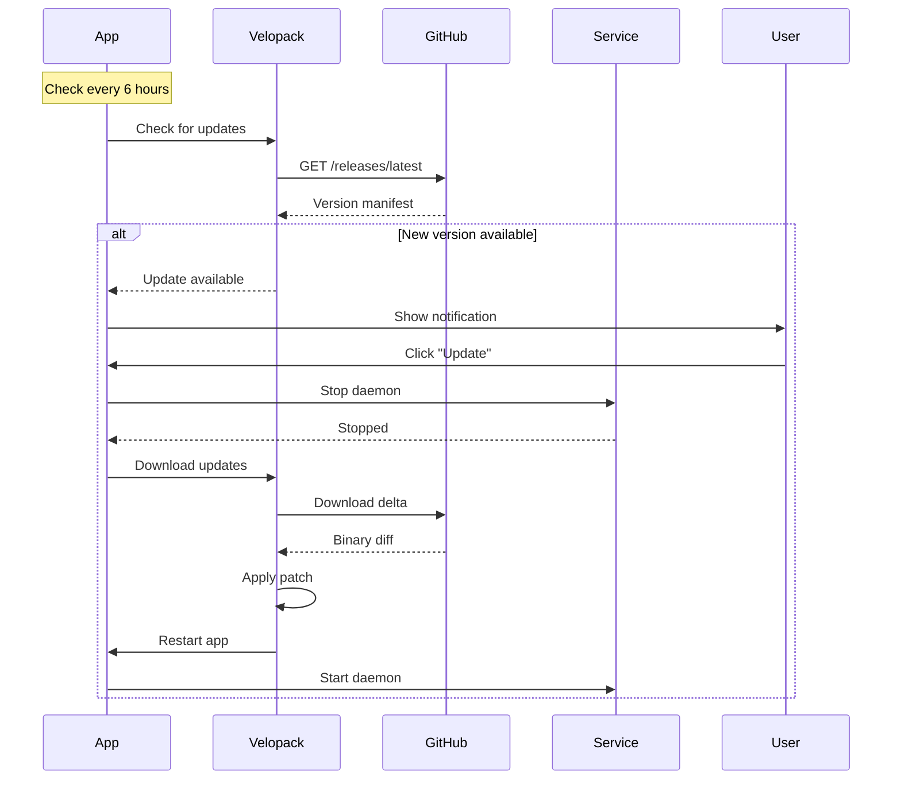

## Overview

Memento AI uses Velopack for automatic updates with delta patches, reducing download sizes from hundreds of megabytes to just a few.

<Info>
  **Update Check**: Every 6 hours  
  **Download Size**: 5-15 MB (delta patches)  
  **Downtime**: ~5 seconds (app restart)
</Info>

---

## Update Flow



---

## Delta Updates

Instead of downloading entire binaries, Velopack downloads only changed bytes:

| Update Type | Size Example |
|-------------|--------------|
| **Full** (first install) | 85 MB |
| **Delta** (patch) | 3-8 MB |
| **Compression** | 90%+ reduction |

---

## Implementation

<CodeGroup>

```rust main.rs (Bootstrap)
fn main() {
    // CRITICAL: Velopack MUST run first
    match velopack::init() {
        Ok(true) => {
            // Normal app startup
            tauri_app_lib::run()
        }
        Ok(false) => {
            // Update hook executed, exit
            std::process::exit(0);
        }
        Err(e) => {
            eprintln!("Velopack init failed: {:?}", e);
            std::process::exit(1);
        }
    }
}
```

```rust Update Check
use velopack::{UpdateManager, UpdateOptions};

pub async fn check_for_updates() -> Result<Option<UpdateInfo>> {
    let manager = UpdateManager::new(UpdateOptions {
        url: "https://github.com/pavan/memento-ai/releases".to_string(),
        ..Default::default()
    })?;
    
    manager.check_for_updates().await
}
```

```rust Apply Update
pub async fn download_and_apply(info: &UpdateInfo) -> Result<()> {
    let manager = UpdateManager::new(/* ... */)?;
    
    // Stop daemon service
    stop_service().await?;
    
    // Download delta patch
    manager.download_updates(info).await?;
    
    // Apply and restart (this function never returns)
    manager.apply_updates_and_restart(info)?;
    
    unreachable!()
}
```

</CodeGroup>

---

## User Experience

### Update Notification

```typescript
// Frontend listens for update event
window.addEventListener('update-available', (event) => {
  const { version, size_mb } = event.detail;
  
  showNotification({
    title: `Update Available: v${version}`,
    message: `Download size: ${size_mb} MB`,
    actions: ['Update Now', 'Later']
  });
});
```

### Progress Tracking

```typescript
// Monitor download progress
const eventSource = new EventSource('/update-progress');

eventSource.onmessage = (event) => {
  const { percent, status } = JSON.parse(event.data);
  
  updateProgressBar(percent);
  updateStatusText(status);
};
```

---

## Rollback Support

If an update fails, users can roll back to the previous version:

```rust
let options = UpdateOptions {
    allow_version_downgrade: true,
    ..Default::default()
};

let manager = UpdateManager::new(options)?;

// Rollback to previous version
if let Some(previous) = manager.get_previous_version()? {
    manager.apply_updates_and_restart(&previous)?;
}
```

---

## Release Process

<Steps>
  <Step title="Build Release">
    ```powershell
    .\scripts\build-release.ps1 -Version "1.2.0"
    ```
  </Step>
  
  <Step title="Package with Velopack">
    ```powershell
    velopack pack --packId memento --packVersion 1.2.0 `
      --mainExe memento.exe `
      --releaseDir .\velopack-output
    ```
  </Step>
  
  <Step title="Upload to GitHub">
    ```powershell
    gh release create v1.2.0 `
      .\velopack-output\Setup.exe `
      .\velopack-output\RELEASES `
      .\velopack-output\memento-1.2.0-full.nupkg
    ```
  </Step>
  
  <Step title="Users Auto-Update">
    Within 6 hours, all users are notified of the new version.
  </Step>
</Steps>

---

## Best Practices

<Card title="Always Check Service Status" icon="shield-check">
  Before applying updates, ensure the daemon service has stopped:
  
  ```rust
  stop_service().await?;
  wait_for_daemon_exit().await?;  // Important!
  ```
</Card>

<Card title="Test Updates Locally" icon="flask">
  Before releasing, test the update flow:
  
  ```powershell
  # Build current version
  .\scripts\build-release.ps1 -Version "1.0.0"
  
  # Install it
  .\velopack-output\Setup.exe
  
  # Build new version
  .\scripts\build-release.ps1 -Version "1.0.1"
  
  # Test update
  .\velopack pack --delta .\velopack-output\memento-1.0.0-full.nupkg
  ```
</Card>

---

## Troubleshooting

<AccordionGroup>
  <Accordion title="Update hangs" icon="hourglass">
    **Cause**: Daemon service didn't stop properly
    
    **Solution**:
    ```powershell
    # Force kill daemon
    taskkill /F /IM memento-daemon.exe
    
    # Retry update
    # App will detect daemon is not running
    ```
  </Accordion>
  
  <Accordion title="Update fails" icon="xmark">
    **Check logs**:
    ```powershell
    Get-Content $env:LOCALAPPDATA\memento\velopack.log
    ```
    
    **Common issues**:
    - Binary in use
    - Insufficient disk space
    - Network error during download
  </Accordion>
  
  <Accordion title="Rollback needed" icon="rotate-left">
    ```typescript
    // Trigger rollback from UI
    await invoke('rollback_to_previous_version');
    ```
    
    Or manually:
    ```powershell
    cd $env:LOCALAPPDATA\memento\packages
    # Find previous version .nupkg
    # Use Velopack CLI to apply it
    ```
  </Accordion>
</AccordionGroup>

---

## Next Steps

<CardGroup cols={2}>
  <Card title="Windows Service" icon="gear" href="/advanced/windows-service">
    Understand service integration.
  </Card>
  <Card title="Building" icon="hammer" href="/deployment/building">
    Build and package releases.
  </Card>
  <Card title="Distribution" icon="box" href="/deployment/distribution">
    Distribute to users.
  </Card>
  <Card title="Desktop App" icon="desktop" href="/architecture/desktop-app">
    Tauri app architecture.
  </Card>
</CardGroup>
