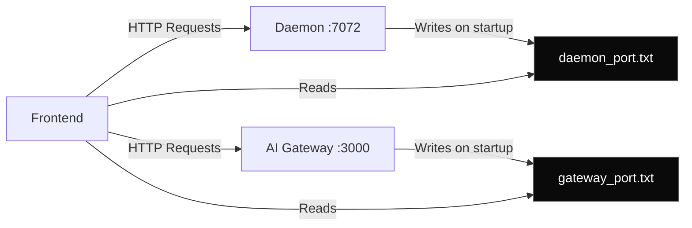

## Overview

Memento AI uses a file-based port registration system to enable automatic service discovery between the frontend, daemon, and AI gateway without hardcoding ports.

<Info>
  **Discovery Method**: File-based port registry  
  **Fallback**: Hardcoded defaults (7072, 3000)  
  **Timeout**: 5 seconds
</Info>

---

## Architecture



---

## Port File Locations

<Tabs>
  <Tab title="Daemon Port">
    **Windows**: `%APPDATA%\Memento\daemon_port.txt`  
    **macOS**: `~/Library/Application Support/Memento/daemon_port.txt`  
    **Linux**: `~/.config/memento/daemon_port.txt`
    
    **Content**:
    ```
    7072
    ```
  </Tab>
  
  <Tab title="Gateway Port">
    **Windows**: `%APPDATA%\Memento\gateway_port.txt`  
    **macOS**: `~/Library/Application Support/Memento/gateway_port.txt`  
    **Linux**: `~/.config/memento/gateway_port.txt`
    
    **Content**:
    ```
    3000
    ```
  </Tab>
</Tabs>

---

## Implementation

### Daemon Registration

```rust
use std::fs;
use std::path::PathBuf;

pub fn register_daemon_port(port: u16) -> Result<()> {
    let port_file = get_app_data_dir()?.join("daemon_port.txt");
    fs::write(&port_file, port.to_string())?;
    Ok(())
}

fn get_app_data_dir() -> Result<PathBuf> {
    #[cfg(target_os = "windows")]
    let base = std::env::var("APPDATA")?;
    
    #[cfg(target_os = "macos")]
    let base = std::env::var("HOME")? + "/Library/Application Support";
    
    #[cfg(target_os = "linux")]
    let base = std::env::var("HOME")? + "/.config";
    
    let dir = PathBuf::from(base).join("Memento");
    fs::create_dir_all(&dir)?;
    Ok(dir)
}
```

### Frontend Discovery

<CodeGroup>

```typescript portUrlResolver.ts
import { readTextFile, BaseDirectory } from '@tauri-apps/plugin-fs';

export async function resolveDaemonUrl(): Promise<string> {
  try {
    const port = await readTextFile('daemon_port.txt', {
      baseDir: BaseDirectory.AppData
    });
    
    return `http://localhost:${port.trim()}`;
  } catch (error) {
    console.warn('Failed to read daemon port, using default 7072', error);
    return 'http://localhost:7072';
  }
}

export async function resolveGatewayUrl(): Promise<string> {
  try {
    const port = await readTextFile('gateway_port.txt', {
      baseDir: BaseDirectory.AppData
    });
    
    return `http://localhost:${port.trim()}`;
  } catch (error) {
    console.warn('Failed to read gateway port, using default 3000', error);
    return 'http://localhost:3000';
  }
}
```

```typescript Usage
import { resolveDaemonUrl } from '@/shared/portUrlResolver';

async function searchSemanticContent(query: string) {
  const baseUrl = await resolveDaemonUrl();
  
  const response = await fetch(`${baseUrl}/search/semantic`, {
    method: 'POST',
    headers: { 'Content-Type': 'application/json' },
    body: JSON.stringify({ query, limit: 10 })
  });
  
  return response.json();
}
```

</CodeGroup>

---

## Gateway Registration

The AI Gateway writes its port on startup:

```typescript
import fs from 'fs/promises';
import path from 'path';
import os from 'os';

async function registerGatewayPort(port: number): Promise<void> {
  const appDataDir = process.platform === 'win32'
    ? path.join(process.env.APPDATA!, 'Memento')
    : process.platform === 'darwin'
    ? path.join(os.homedir(), 'Library/Application Support/Memento')
    : path.join(os.homedir(), '.config/memento');
  
  await fs.mkdir(appDataDir, { recursive: true });
  
  const portFile = path.join(appDataDir, 'gateway_port.txt');
  await fs.writeFile(portFile, port.toString(), 'utf-8');
  
  console.log(`Registered gateway port: ${port}`);
}

const PORT = process.env.PORT || 3000;
app.listen(PORT, async () => {
  await registerGatewayPort(Number(PORT));
  console.log(`AI Gateway listening on port ${PORT}`);
});
```

---

## Health Checks

After discovering ports, verify services are reachable:

```typescript
async function waitForDaemonReady(timeout = 5000): Promise<boolean> {
  const baseUrl = await resolveDaemonUrl();
  const start = Date.now();
  
  while (Date.now() - start < timeout) {
    try {
      const response = await fetch(`${baseUrl}/health`, {
        signal: AbortSignal.timeout(1000)
      });
      
      if (response.ok) {
        return true;
      }
    } catch {
      // Service not ready yet
    }
    
    await new Promise(resolve => setTimeout(resolve, 200));
  }
  
  return false;
}
```

---

## Edge Cases

<AccordionGroup>
  <Accordion title="Port file doesn't exist" icon="file-slash">
    **Scenario**: Fresh install or service not started
    
    **Behavior**:
    ```typescript
    // Falls back to hardcoded defaults
    const daemonUrl = 'http://localhost:7072';
    const gatewayUrl = 'http://localhost:3000';
    ```
  </Accordion>
  
  <Accordion title="Port already in use" icon="network-wired">
    **Scenario**: Another app using default port
    
    **Solution**: Daemon picks random available port
    ```rust
    let port = find_available_port(7072..8000)?;
    register_daemon_port(port)?;
    ```
  </Accordion>
  
  <Accordion title="Stale port file" icon="clock-rotate-left">
    **Scenario**: Port file from previous session, service crashed
    
    **Detection**:
    ```typescript
    const isReachable = await fetch(`${baseUrl}/health`)
      .then(r => r.ok)
      .catch(() => false);
    
    if (!isReachable) {
      // Retry with default port
      // Or show error to restart service
    }
    ```
  </Accordion>
</AccordionGroup>

---

## Multi-Instance Support

To run multiple instances (e.g., development + production):

```rust
// Use different app data directories
fn get_app_data_dir(env: &str) -> PathBuf {
    let base = std::env::var("APPDATA").unwrap();
    PathBuf::from(base).join(format!("Memento-{}", env))
}

// Development
register_daemon_port(7072, "dev")?;

// Production
register_daemon_port(7073, "prod")?;
```

Frontend selects environment:

```typescript
const env = process.env.NODE_ENV === 'development' ? 'dev' : 'prod';
const port = await readTextFile(`daemon_port_${env}.txt`, {
  baseDir: BaseDirectory.AppData
});
```

---

## Best Practices

<Card title="Always Write Port on Startup" icon="pen">
  Even if using default port, write to file for consistency:
  
  ```rust
  let port = config.port.unwrap_or(7072);
  register_daemon_port(port)?;
  ```
</Card>

<Card title="Health Check After Discovery" icon="heart-pulse">
  Don't assume port file is accurate:
  
  ```typescript
  const url = await resolveDaemonUrl();
  if (!await isServiceHealthy(url)) {
    throw new Error('Daemon not responding');
  }
  ```
</Card>

<Card title="Clean Up on Exit" icon="trash">
  Remove port file when service stops gracefully:
  
  ```rust
  impl Drop for DaemonServer {
      fn drop(&mut self) {
          let _ = fs::remove_file(get_port_file_path());
      }
  }
  ```
</Card>

---

## Next Steps

<CardGroup cols={2}>
  <Card title="Desktop App" icon="desktop" href="/architecture/desktop-app">
    Tauri IPC integration.
  </Card>
  <Card title="Data Flow" icon="diagram-project" href="/architecture/data-flow">
    System communication flows.
  </Card>
  <Card title="AI Gateway" icon="microchip" href="/api-reference/models">
    Gateway API reference.
  </Card>
  <Card title="Troubleshooting" icon="wrench" href="/deployment/troubleshooting">
    Debug connection issues.
  </Card>
</CardGroup>
