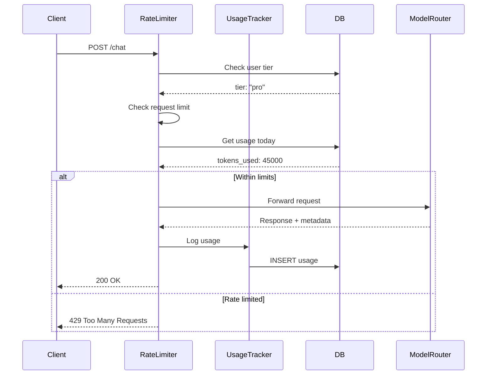

## Overview

The AI Gateway implements multi-layer rate limiting to prevent abuse, manage costs, and ensure fair usage across devices and users.

<Info>
  **Algorithms**: Token bucket + Sliding window  
  **Storage**: PostgreSQL (persistent)  
  **Scope**: Per user, per device, global
</Info>

---

## Rate Limit Tiers

| Tier | Requests/Min | Tokens/Day | Cost/Month |
|------|--------------|------------|------------|
| **Free** | 10 | 50,000 | $0 |
| **Pro** | 60 | 500,000 | $10 |
| **Team** | 120 | 2,000,000 | $50 |

---

## Architecture



---

## Implementation

### Rate Limiter

<CodeGroup>

```typescript rateLimiter.ts
import rateLimit from 'express-rate-limit';
import RedisStore from 'rate-limit-redis';
import { Redis } from 'ioredis';

const redis = new Redis(process.env.REDIS_URL);

export const apiRateLimiter = rateLimit({
  store: new RedisStore({
    client: redis,
    prefix: 'rl:api:'
  }),
  windowMs: 60 * 1000, // 1 minute
  max: async (req) => {
    // Dynamic limit based on user tier
    const user = req.user;
    return getTierLimit(user.tier);
  },
  message: {
    error: 'Too many requests',
    retryAfter: 60
  },
  standardHeaders: true, // Return rate limit info in headers
  legacyHeaders: false
});

function getTierLimit(tier: string): number {
  switch (tier) {
    case 'free': return 10;
    case 'pro': return 60;
    case 'team': return 120;
    default: return 10;
  }
}
```

```typescript Usage Tracking
import { db } from './db';
import { usageLog } from './db/schema';

export async function trackUsage(params: {
  userId: string;
  deviceId: string;
  model: string;
  inputTokens: number;
  outputTokens: number;
  costUsd: number;
}) {
  await db.insert(usageLog).values({
    userId: params.userId,
    deviceId: params.deviceId,
    model: params.model,
    inputTokens: params.inputTokens,
    outputTokens: params.outputTokens,
    totalTokens: params.inputTokens + params.outputTokens,
    costUsd: params.costUsd,
    timestamp: new Date()
  });
}
```

```typescript Daily Limit Check
export async function checkDailyLimit(userId: string): Promise<boolean> {
  const today = new Date();
  today.setHours(0, 0, 0, 0);
  
  const usage = await db
    .select({
      totalTokens: sql`SUM(${usageLog.totalTokens})`
    })
    .from(usageLog)
    .where(
      and(
        eq(usageLog.userId, userId),
        gte(usageLog.timestamp, today)
      )
    )
    .limit(1);
  
  const tokensUsed = usage[0]?.totalTokens || 0;
  const user = await getUserTier(userId);
  const limit = getDailyTokenLimit(user.tier);
  
  return tokensUsed < limit;
}
```

</CodeGroup>

---

## Middleware

Apply rate limiting to routes:

```typescript
import { apiRateLimiter } from './rateLimiter';
import { checkDailyLimit } from './usageTracker';

app.post('/chat', 
  apiRateLimiter,
  async (req, res, next) => {
    // Check daily token limit
    const hasQuota = await checkDailyLimit(req.user.id);
    
    if (!hasQuota) {
      return res.status(429).json({
        error: 'Daily token limit exceeded',
        limit: getDailyTokenLimit(req.user.tier),
        resetAt: getTomorrowMidnight()
      });
    }
    
    next();
  },
  chatController.handleChat
);
```

---

## Response Headers

Rate limit info is included in every response:

```http
HTTP/1.1 200 OK
X-RateLimit-Limit: 60
X-RateLimit-Remaining: 42
X-RateLimit-Reset: 1711234567
X-Daily-Token-Limit: 500000
X-Daily-Tokens-Used: 45230
X-Daily-Tokens-Remaining: 454770
```

---

## Client Handling

<CodeGroup>

```typescript Frontend Retry
async function sendChatMessage(message: string) {
  try {
    const response = await fetch('/api/chat', {
      method: 'POST',
      headers: { 'Content-Type': 'application/json' },
      body: JSON.stringify({ message })
    });
    
    if (response.status === 429) {
      const retryAfter = response.headers.get('Retry-After');
      const resetTime = new Date(parseInt(retryAfter!) * 1000);
      
      throw new Error(`Rate limited. Try again at ${resetTime.toLocaleTimeString()}`);
    }
    
    return await response.json();
  } catch (error) {
    console.error('Chat error:', error);
    throw error;
  }
}
```

```typescript Show Quota
function QuotaDisplay() {
  const [quota, setQuota] = useState(null);
  
  useEffect(() => {
    fetch('/api/usage/quota')
      .then(r => r.json())
      .then(setQuota);
  }, []);
  
  if (!quota) return null;
  
  const percentUsed = (quota.used / quota.limit) * 100;
  
  return (
    <div>
      <p>Tokens used today: {quota.used.toLocaleString()} / {quota.limit.toLocaleString()}</p>
      <ProgressBar value={percentUsed} />
      {percentUsed > 90 && (
        <Alert>You've used {percentUsed.toFixed(0)}% of your daily quota</Alert>
      )}
    </div>
  );
}
```

</CodeGroup>

---

## Usage Analytics

Query usage patterns:

```sql
-- Top users by token usage
SELECT 
  user_id,
  SUM(total_tokens) as total_tokens,
  SUM(cost_usd) as total_cost,
  COUNT(*) as request_count
FROM usage_log
WHERE timestamp >= NOW() - INTERVAL '30 days'
GROUP BY user_id
ORDER BY total_tokens DESC
LIMIT 10;

-- Most expensive models
SELECT 
  model,
  COUNT(*) as requests,
  AVG(total_tokens) as avg_tokens,
  SUM(cost_usd) as total_cost
FROM usage_log
WHERE timestamp >= NOW() - INTERVAL '7 days'
GROUP BY model
ORDER BY total_cost DESC;

-- Hourly request distribution
SELECT 
  DATE_TRUNC('hour', timestamp) as hour,
  COUNT(*) as requests,
  SUM(total_tokens) as tokens
FROM usage_log
WHERE timestamp >= NOW() - INTERVAL '24 hours'
GROUP BY hour
ORDER BY hour;
```

---

## Cost Calculation

Token costs vary by model:

```typescript
const MODEL_COSTS = {
  'gpt-4o': {
    input: 0.0025 / 1000,  // $2.50 per 1M tokens
    output: 0.010 / 1000   // $10 per 1M tokens
  },
  'gpt-4o-mini': {
    input: 0.00015 / 1000,
    output: 0.0006 / 1000
  },
  'claude-3.5-sonnet': {
    input: 0.003 / 1000,
    output: 0.015 / 1000
  }
};

function calculateCost(model: string, inputTokens: number, outputTokens: number): number {
  const pricing = MODEL_COSTS[model] || MODEL_COSTS['gpt-4o'];
  
  return (inputTokens * pricing.input) + (outputTokens * pricing.output);
}
```

---

## Best Practices

<Card title="Use Redis for Rate Limiting" icon="bolt">
  PostgreSQL is too slow for high-frequency checks:
  
  ```typescript
  // Fast: Redis (in-memory)
  const limiter = new RedisStore({ client: redis });
  
  // Slow: PostgreSQL (disk-based)
  // Don't do this for every request
  ```
</Card>

<Card title="Log Usage Asynchronously" icon="clock">
  Don't block request while writing usage:
  
  ```typescript
  // Fire and forget
  trackUsage(params).catch(err => 
    console.error('Usage tracking failed:', err)
  );
  
  // Return response immediately
  res.json({ message: 'Success' });
  ```
</Card>

<Card title="Set Conservative Limits" icon="shield">
  Start strict, then relax based on abuse patterns:
  
  ```typescript
  // Start with low limits
  const FREE_TIER_LIMIT = 10; // requests/min
  
  // Monitor for abuse
  // Increase if no issues after 1 month
  ```
</Card>

---

## Troubleshooting

<AccordionGroup>
  <Accordion title="False rate limit triggers" icon="triangle-exclamation">
    **Issue**: Legitimate users getting rate limited
    
    **Diagnosis**:
    ```sql
    SELECT user_id, COUNT(*) as requests
    FROM usage_log
    WHERE timestamp >= NOW() - INTERVAL '1 minute'
    GROUP BY user_id
    HAVING COUNT(*) > 50;
    ```
    
    **Solution**: Increase tier limits or whitelist user
  </Accordion>
  
  <Accordion title="Redis connection lost" icon="plug">
    **Graceful degradation**:
    ```typescript
    const limiter = rateLimit({
      store: new RedisStore({ client: redis }),
      skip: (req) => {
        // Skip rate limiting if Redis is down
        if (!redis.status === 'ready') {
          console.warn('Redis unavailable, skipping rate limit');
          return true;
        }
        return false;
      }
    });
    ```
  </Accordion>
  
  <Accordion title="Usage not tracking" icon="database">
    **Check database**:
    ```sql
    SELECT COUNT(*) FROM usage_log 
    WHERE timestamp >= NOW() - INTERVAL '1 hour';
    ```
    
    If zero, check:
    - Database connection
    - `trackUsage()` error logs
    - Async promise handling
  </Accordion>
</AccordionGroup>

---

## Next Steps

<CardGroup cols={2}>
  <Card title="AI Gateway" icon="microchip" href="/architecture/data-flow">
    Gateway architecture overview.
  </Card>
  <Card title="Usage API" icon="chart-line" href="/api-reference/models">
    Query usage statistics.
  </Card>
  <Card title="Database Schema" icon="table" href="/architecture/database-schema">
    Usage tracking tables.
  </Card>
  <Card title="Authentication" icon="lock" href="/getting-started/privacy-setup">
    User authentication flow.
  </Card>
</CardGroup>
