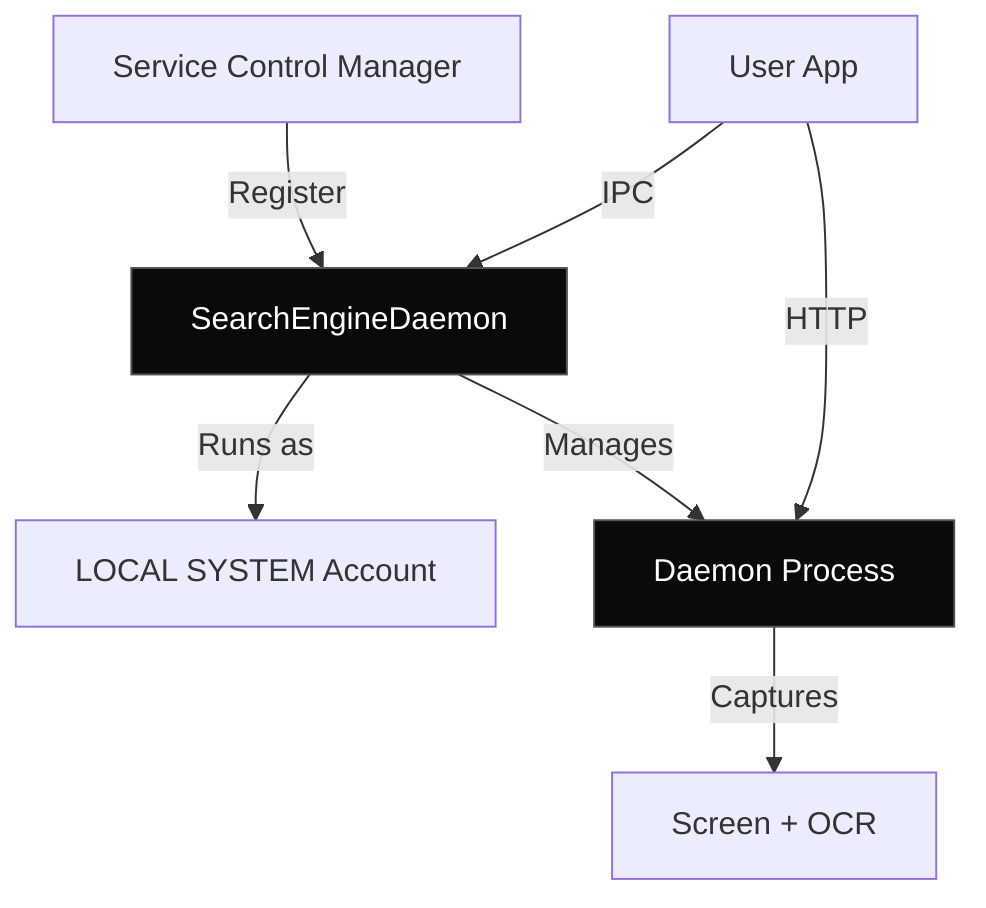

## Overview

Memento AI's daemon runs as a Windows Service, enabling 24/7 background operation with proper system integration, automatic startup, and graceful shutdown handling.

<Info>
  **Service Name**: `SearchEngineDaemon`  
  **Account**: LOCAL SYSTEM  
  **Startup**: Automatic (Delayed Start)
</Info>

---

## Architecture



---

## Service Control

### Install Service

Requires Administrator privileges (UAC prompt):

```powershell
.\service-helper.exe install --daemon-path "C:\path\to\memento-daemon.exe"
```

This:
1. Registers service with SCM
2. Sets permissions for user control
3. Configures automatic startup
4. Does NOT start the service yet

### Start Service

```powershell
# Via service helper
.\service-helper.exe start

# Or directly via SC
sc start SearchEngineDaemon

# Or via Tauri app (no UAC)
# App manages service automatically
```

### Stop Service

```powershell
# Graceful stop
sc stop SearchEngineDaemon

# Force kill (if hanging)
taskkill /F /IM memento-daemon.exe
```

### Uninstall Service

```powershell
.\service-helper.exe uninstall
```

---

## Permissions

The service is configured with permissions that allow normal users to control it without UAC:

```powershell
sc sdset SearchEngineDaemon "D:(A;;CCLCSWRPWPDTLOCRRC;;;SY)(A;;CCDCLCSWRPWPDTLOCRSDRCWDWO;;;BA)(A;;CCLCSWLOCRRC;;;BU)(A;;RPWPCR;;;BU)"
```

**Breakdown**:
- `SY` (LOCAL SYSTEM): Full control
- `BA` (Administrators): Full control
- `BU` (Built-in Users): Read, start, stop, control

---

## Graceful Shutdown

The daemon MUST handle Windows Service stop signals properly:

```rust
use windows_service::service_control_handler::{
    self, ServiceControlHandlerResult
};

fn service_control_handler(
    control_event: ServiceControl,
    shutdown: Arc<ShutdownController>
) -> ServiceControlHandlerResult {
    match control_event {
        ServiceControl::Stop => {
            // Signal all tasks to shutdown
            shutdown.request_shutdown();
            ServiceControlHandlerResult::NoError
        }
        ServiceControl::Interrogate => {
            ServiceControlHandlerResult::NoError
        }
        _ => ServiceControlHandlerResult::NotImplemented
    }
}
```

<Warning>
  If the daemon doesn't handle stop signals, updates will hang because Windows can't replace running binaries.
</Warning>

---

## Auto-Updates

### Update Flow

1. App checks for updates
2. **Stops the service**
3. Waits for daemon process to exit
4. Velopack applies binary patch
5. App restarts
6. Post-update hook starts service

```rust
pub async fn apply_update(update_info: &UpdateInfo) -> Result<()> {
    // Stop service before updating
    stop_service().await?;
    
    // Wait for process to fully exit
    wait_for_daemon_exit().await?;
    
    // Apply update
    update_manager.apply_updates_and_restart(update_info)?;
    
    // This line never executes (app restarts)
    unreachable!()
}
```

---

## Logging

Service logs are written to multiple locations:

<Tabs>
  <Tab title="Application Logs">
    **Location**: `%APPDATA%\Memento\logs\daemon.log`  
    **Format**: Daily rolling files  
    **Retention**: 30 days
    
    ```
    [2024-03-24 14:30:15] INFO: Service started
    [2024-03-24 14:30:16] INFO: Capture loop initialized
    [2024-03-24 14:30:17] INFO: HTTP server listening on :7072
    ```
  </Tab>
  
  <Tab title="Windows Event Log">
    **Log Name**: Application  
    **Source**: SearchEngineDaemon
    
    ```powershell
    Get-EventLog -LogName Application -Source SearchEngineDaemon -Newest 10
    ```
  </Tab>
  
  <Tab title="Sentry (Production)">
    **Integration**: `sentry-rust`  
    **Environment**: `production`  
    **DSN**: Configured via environment variable
    
    Captures errors and performance metrics.
  </Tab>
</Tabs>

---

## Troubleshooting

<AccordionGroup>
  <Accordion title="Service won't start" icon="triangle-exclamation">
    **Check Event Logs**:
    ```powershell
    Get-EventLog -LogName Application -Source SearchEngineDaemon -Newest 5
    ```
    
    **Common Issues**:
    - Port already in use
    - Missing DirectML.dll
    - Database locked
    - Insufficient permissions
  </Accordion>
  
  <Accordion title="Service won't stop" icon="ban">
    **Diagnosis**:
    ```powershell
    # Check if daemon is responding
    sc query SearchEngineDaemon
    
    # Check process
    Get-Process memento-daemon
    ```
    
    **Solution**:
    ```powershell
    # Force kill
    taskkill /F /IM memento-daemon.exe
    
    # Clean up service
    sc delete SearchEngineDaemon
    ```
  </Accordion>
  
  <Accordion title="Permissions denied" icon="lock">
    **Reset Permissions**:
    ```powershell
    .\service-helper.exe install --daemon-path "C:\path\to\memento-daemon.exe"
    ```
    
    This re-registers the service with proper permissions.
  </Accordion>
</AccordionGroup>

---

## Next Steps

<CardGroup cols={2}>
  <Card title="Auto-Updates" icon="download" href="/advanced/auto-updates">
    Learn about Velopack integration.
  </Card>
  <Card title="Desktop App" icon="desktop" href="/architecture/desktop-app">
    Understand Tauri app integration.
  </Card>
  <Card title="Building" icon="hammer" href="/deployment/building">
    Build and package the service.
  </Card>
  <Card title="Troubleshooting" icon="wrench" href="/deployment/troubleshooting">
    Common issues and solutions.
  </Card>
</CardGroup>
