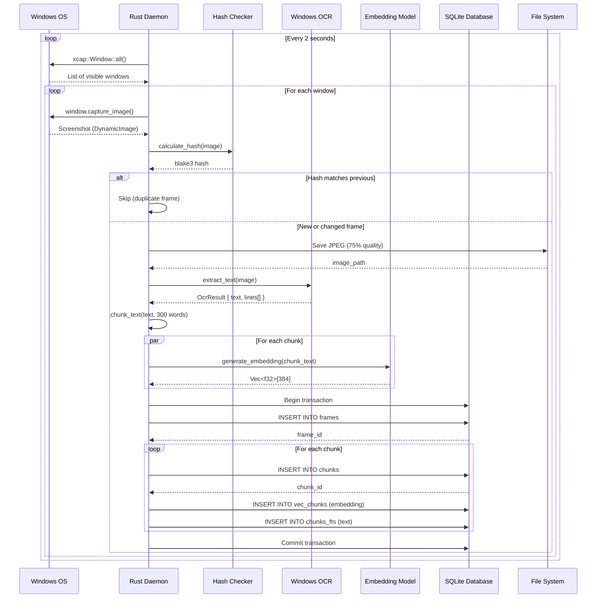
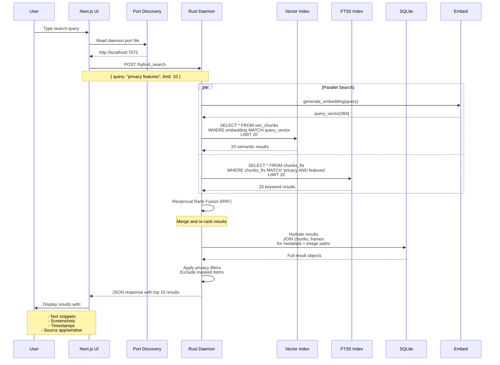
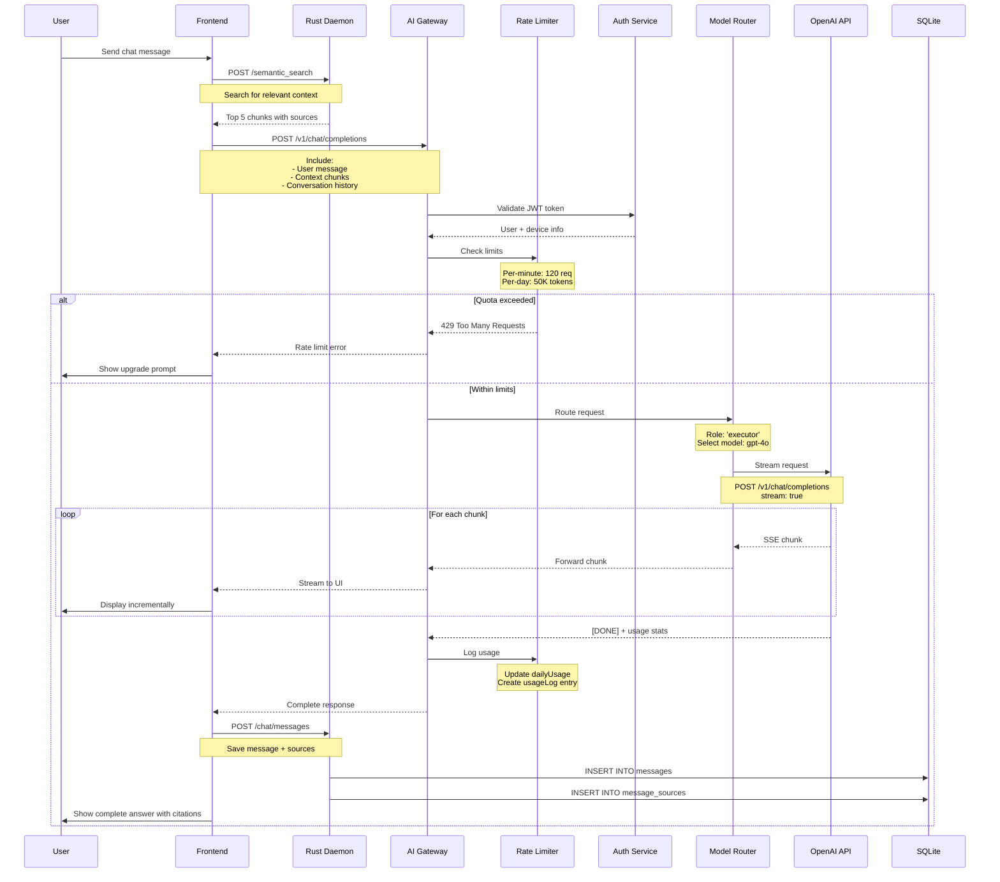
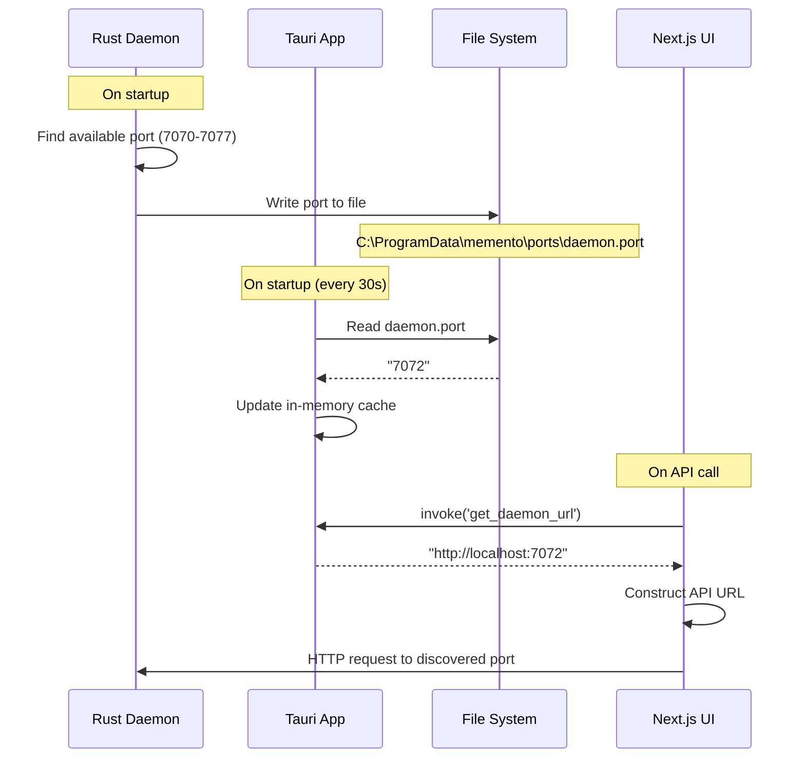
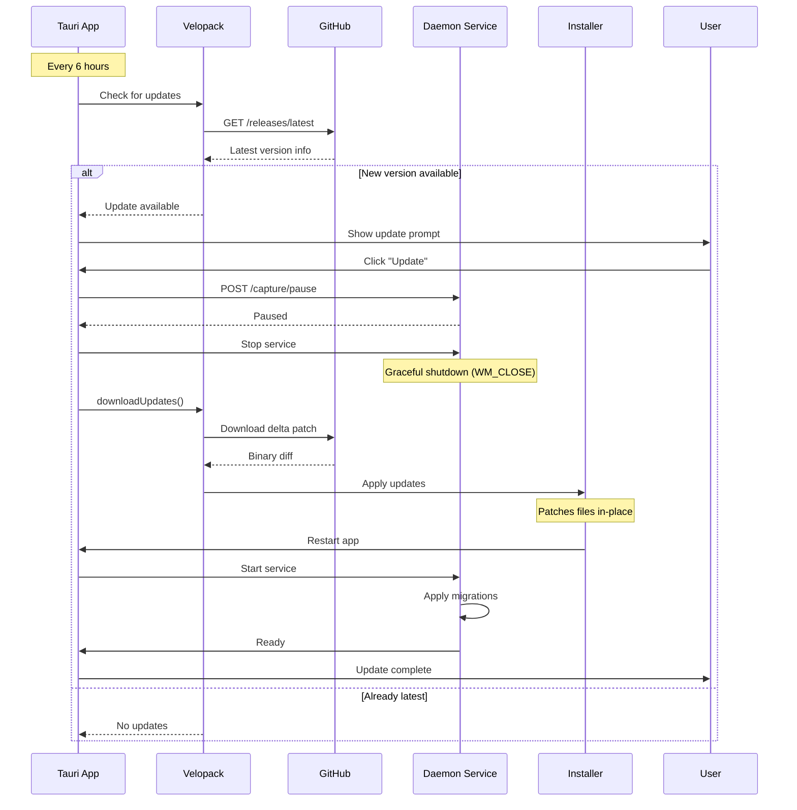

## Overview

This document traces data as it flows through Memento AI's architecture, from screen capture to search results to AI-powered responses.

---

## Flow 1: Screen Capture to Storage



### Step-by-Step

<Steps>
  <Step title="Window Enumeration">
    Daemon queries Windows for all visible windows using `xcap::Window::all()`. Filters out:
    - Hidden windows
    - System UI elements
    - Windows below size threshold (50x50 px)
  </Step>
  
  <Step title="Screen Capture">
    For each window, captures a screenshot as `DynamicImage` (PNG in memory).
    
    **Metadata extracted**:
    - App name (e.g., `chrome.exe`)
    - Window title
    - Window bounds (x, y, width, height)
    - Browser URL (if applicable)
  </Step>
  
  <Step title="Hash Deduplication">
    Computes Blake3 hash of image bytes. If hash matches the previous frame:
    - **Skip** OCR and storage
    - Continue to next window
    
    This prevents indexing static screens.
  </Step>
  
  <Step title="Image Storage">
    Saves image as JPEG with 75% quality to:
    ```
    %APPDATA%\Memento\images\{YYYYMMDD}\{frame_id}.jpg
    ```
    
    Organized by date for easy cleanup.
  </Step>
  
  <Step title="OCR Extraction">
    Passes image to Windows OCR engine:
    - Returns text content
    - Line-level bounding boxes
    - Confidence scores
    
    **Languages supported**: English (default), Spanish, French, German, Chinese, etc.
  </Step>
  
  <Step title="Text Chunking">
    Splits OCR text into overlapping chunks:
    - **Chunk size**: 300 words
    - **Overlap**: 50 words
    
    Ensures semantic coherence and prevents information loss at boundaries.
  </Step>
  
  <Step title="Embedding Generation">
    For each chunk, generates a dense vector embedding:
    - **Model**: `sentence-transformers/all-MiniLM-L6-v2`
    - **Dimensions**: 384 (float32)
    - **Backend**: ONNX Runtime with DirectML GPU acceleration
    
    Embeddings enable semantic similarity search.
  </Step>
  
  <Step title="Database Insertion">
    Stores everything in SQLite within a single transaction:
    1. Insert frame metadata → get `frame_id`
    2. For each chunk:
       - Insert into `chunks` table → get `chunk_id`
       - Insert embedding into `vec_chunks`
       - Insert text into `chunks_fts` (full-text index)
    
    **Transaction ensures**: All-or-nothing consistency.
  </Step>
</Steps>

---

## Flow 2: Search Query



### Search Pipeline

<Tabs>
  <Tab title="1. Query Embedding">
    The search query is embedded using the same model as indexing:
    
    ```rust
    let query_embedding = embedding_model
        .embed(vec![&query], None)?
        .into_iter()
        .next()
        .unwrap();
    ```
    
    This ensures vector space consistency.
  </Tab>
  
  <Tab title="2. Vector Search">
    Performs approximate nearest neighbor (ANN) search:
    
    ```sql
    SELECT 
        chunk_id,
        distance
    FROM vec_chunks
    WHERE embedding MATCH ?
    ORDER BY distance ASC
    LIMIT 20;
    ```
    
    Uses cosine distance metric.
  </Tab>
  
  <Tab title="3. Keyword Search">
    Performs BM25-ranked full-text search:
    
    ```sql
    SELECT 
        chunk_id,
        bm25(chunks_fts) as score
    FROM chunks_fts
    WHERE chunks_fts MATCH ?
    ORDER BY score DESC
    LIMIT 20;
    ```
    
    Supports operators: `AND`, `OR`, `NOT`, `"exact phrase"`.
  </Tab>
  
  <Tab title="4. Reciprocal Rank Fusion">
    Merges results using RRF algorithm:
    
    ```rust
    fn reciprocal_rank_fusion(
        semantic: Vec<Result>,
        keyword: Vec<Result>,
        k: f32
    ) -> Vec<Result> {
        let mut scores = HashMap::new();
        
        for (rank, result) in semantic.iter().enumerate() {
            *scores.entry(result.id).or_insert(0.0) += 
                1.0 / (k + rank as f32);
        }
        
        for (rank, result) in keyword.iter().enumerate() {
            *scores.entry(result.id).or_insert(0.0) += 
                1.0 / (k + rank as f32);
        }
        
        scores.into_iter()
            .sorted_by(|a, b| b.1.partial_cmp(&a.1).unwrap())
            .take(10)
            .collect()
    }
    ```
    
    **k = 60** is the standard constant.
  </Tab>
  
  <Tab title="5. Hydration">
    Fetches full metadata for matched chunks:
    
    ```sql
    SELECT 
        c.id as chunk_id,
        c.text_content,
        c.text_json,
        f.id as frame_id,
        f.app_name,
        f.window_title,
        f.browser_url,
        f.image_path,
        f.captured_at
    FROM chunks c
    JOIN frames f ON f.id = c.frame_id
    WHERE c.id IN (?, ?, ..., ?)
    ```
  </Tab>
  
  <Tab title="6. Privacy Filtering">
    Removes results matching masked items:
    
    ```rust
    results.retain(|r| {
        !is_masked(&r.app_name, &masked_apps) &&
        !is_masked(&r.browser_url, &masked_domains)
    });
    ```
  </Tab>
</Tabs>

---

## Flow 3: AI Chat Response



### Chat Pipeline

<Steps>
  <Step title="Context Retrieval">
    Frontend performs a semantic search to find relevant screen captures:
    
    ```typescript
    const context = await daemonApi.semanticSearch({
      query: userMessage,
      limit: 5,
      timeRange: { days: 30 }  // Last 30 days
    });
    ```
  </Step>
  
  <Step title="Request Construction">
    Builds chat completion request with system prompt:
    
    ```typescript
    const messages = [
      {
        role: 'system',
        content: `You are Memento AI. Answer based on the user's personal memory:
          
Context:
${context.map(c => c.text_content).join('\n\n')}

Always cite sources using [frame_id] notation.`
      },
      ...conversationHistory,
      {
        role: 'user',
        content: userMessage
      }
    ];
    ```
  </Step>
  
  <Step title="Authentication">
    Gateway validates JWT and retrieves user/device info:
    
    ```typescript
    const { userId, deviceId } = await verifyJWT(authToken);
    ```
  </Step>
  
  <Step title="Rate Limiting">
    Checks per-minute and per-day quotas:
    
    ```typescript
    const tier = await getRateLimitTier(deviceId);
    
    if (tier.requestsThisMinute >= tier.maxRequestsPerMinute) {
      throw new RateLimitError('Per-minute limit exceeded');
    }
    
    if (tier.tokensToday >= tier.maxTokensPerDay) {
      // Downgrade to free tier
      tier.currentTier = 'free';
    }
    ```
  </Step>
  
  <Step title="Model Selection">
    Router chooses model based on role and tier:
    
    ```typescript
    const model = selectModel({
      role: 'executor',  // Main response generation
      tier: user.tier,   // 'free' | 'premium'
      fallbackChain: ['gpt-4o', 'gpt-4o-mini', 'gpt-3.5-turbo']
    });
    ```
  </Step>
  
  <Step title="LLM Streaming">
    Forwards request to OpenAI with streaming:
    
    ```typescript
    const stream = await openai.chat.completions.create({
      model,
      messages,
      stream: true
    });
    
    for await (const chunk of stream) {
      res.write(`data: ${JSON.stringify(chunk)}\n\n`);
    }
    ```
  </Step>
  
  <Step title="Usage Tracking">
    Records token usage for quota enforcement:
    
    ```typescript
    await db.usageLog.create({
      deviceId,
      modelName: model,
      role: 'executor',
      promptTokens: usage.prompt_tokens,
      completionTokens: usage.completion_tokens,
      totalTokens: usage.total_tokens
    });
    
    await db.dailyUsage.increment({
      deviceId,
      date: today,
      totalTokens: usage.total_tokens
    });
    ```
  </Step>
  
  <Step title="Message Persistence">
    Saves conversation to local SQLite:
    
    ```rust
    let message_id = sqlx::query!(
        "INSERT INTO messages (session_id, role, content) VALUES (?, ?, ?)",
        session_id, "assistant", response_text
    ).execute(&pool).await?.last_insert_rowid();
    
    // Link to source chunks
    for chunk_id in cited_chunks {
        sqlx::query!(
            "INSERT INTO message_sources (message_id, chunk_id, usage_type) 
             VALUES (?, ?, 'citation')",
            message_id, chunk_id
        ).execute(&pool).await?;
    }
    ```
  </Step>
</Steps>

---

## Flow 4: Port Discovery



### Why Port Discovery?

Multiple instances of the daemon might run (development + production), and ports could be occupied. Port files enable:

1. **Automatic port selection**: Daemon picks first available port
2. **No hardcoding**: Frontend adapts to any port
3. **Multi-instance support**: Dev daemon on 7070, prod on 7071

<CodeGroup>

```rust Daemon: Write Port
// On server startup
let port = find_available_port(7070..=7077)?;
let server = Server::bind(&format!("127.0.0.1:{}", port));

// Write port to shared location
let port_file = PathBuf::from(r"C:\ProgramData\memento\ports\daemon.port");
fs::write(&port_file, port.to_string())?;
```

```rust Tauri: Read Port
// Refreshed every 30 seconds
#[tauri::command]
fn get_daemon_url() -> Result<String, String> {
    let port_file = PathBuf::from(r"C:\ProgramData\memento\ports\daemon.port");
    let port = fs::read_to_string(&port_file)
        .map_err(|e| format!("Failed to read port file: {}", e))?;
    
    Ok(format!("http://localhost:{}", port.trim()))
}
```

```typescript Frontend: Use Port
// API client (app/frontend/api/base.ts)
export async function getDaemonUrl(): Promise<string> {
  if (window.__TAURI__) {
    return await invoke<string>('get_daemon_url');
  }
  
  // Fallback for web mode
  return 'http://localhost:7070';
}

// Usage
const url = await getDaemonUrl();
const response = await fetch(`${url}/semantic_search`, { ... });
```

</CodeGroup>

---

## Flow 5: Auto-Update



**Key points**:
- **Delta updates**: Only download changed bytes (typically < 5 MB)
- **Service coordination**: Daemon must stop before binary replacement
- **Rollback support**: Can revert to previous version if update fails

---

## Next Steps

<CardGroup cols={2}>
  <Card title="Architecture Overview" icon="diagram-project" href="/architecture/overview">
    Return to architecture overview.
  </Card>
  <Card title="API Reference" icon="code" href="/api-reference/overview">
    Explore REST API endpoints.
  </Card>
  <Card title="Database Schema" icon="database" href="/architecture/database-schema">
    Deep dive into data models.
  </Card>
  <Card title="Troubleshooting" icon="wrench" href="/deployment/troubleshooting">
    Common issues and solutions.
  </Card>
</CardGroup>
