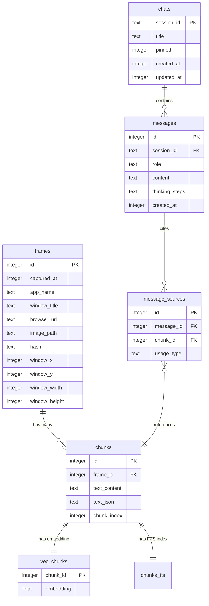
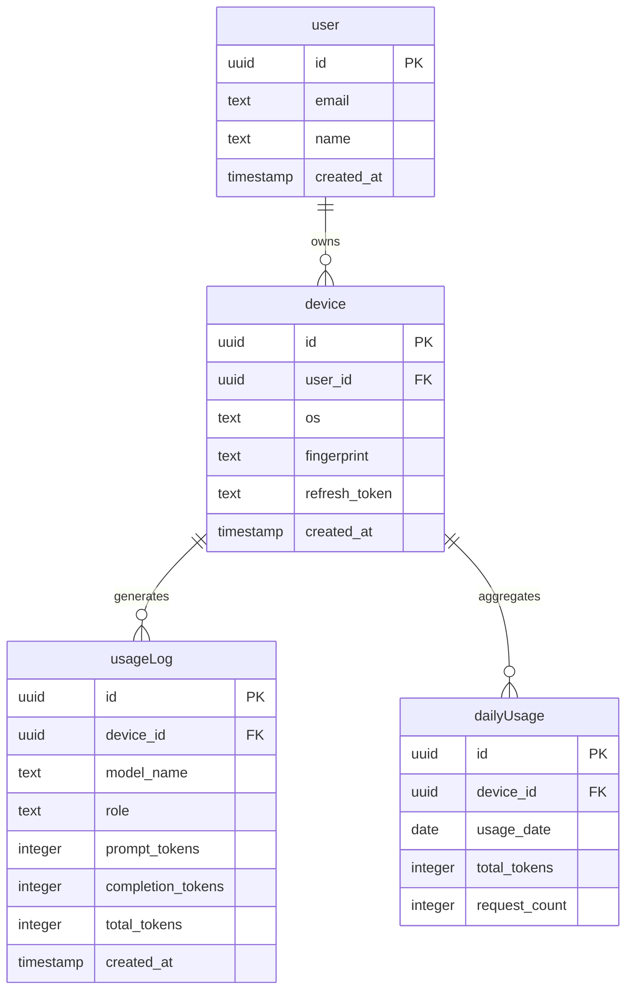

## Overview

Memento AI uses two database systems:

- **SQLite**: Local data storage for screen captures, OCR text, embeddings, and chat history
- **PostgreSQL**: Gateway state for authentication, usage tracking, and rate limiting

---

## SQLite Schema (Local Data)

<Info>
  **Location**: `%APPDATA%\Memento\data\memento.db`  
  **Size**: Grows with usage (typical: 1-10 GB)
</Info>

### Entity Relationship Diagram



---

### Core Tables

<Tabs>
  <Tab title="frames">
    **Purpose**: Store metadata for each screen capture
    
    ```sql
    CREATE TABLE frames (
        id INTEGER PRIMARY KEY AUTOINCREMENT,
        captured_at INTEGER NOT NULL,  -- Unix timestamp
        app_name TEXT,                 -- e.g., "Chrome", "VSCode"
        window_title TEXT,             -- e.g., "GitHub - Repository"
        browser_url TEXT,              -- Extracted URL if browser
        image_path TEXT NOT NULL,      -- Relative path to JPEG
        hash TEXT UNIQUE,              -- Blake3 hash for dedup
        window_x INTEGER,              -- Screen position
        window_y INTEGER,
        window_width INTEGER,
        window_height INTEGER,
        
        -- Indexes
        CREATE INDEX idx_frames_captured_at ON frames(captured_at);
        CREATE INDEX idx_frames_app_name ON frames(app_name);
        CREATE INDEX idx_frames_hash ON frames(hash);
    );
    ```
    
    **Example Row**:
    ```json
    {
      "id": 1234,
      "captured_at": 1711234567,
      "app_name": "chrome.exe",
      "window_title": "Memento AI - Documentation",
      "browser_url": "https://docs.memento.ai",
      "image_path": "images/20240324/1234.jpg",
      "hash": "a8f3e2...",
      "window_x": 0,
      "window_y": 0,
      "window_width": 1920,
      "window_height": 1080
    }
    ```
  </Tab>
  
  <Tab title="chunks">
    **Purpose**: Store OCR text chunks with bounding boxes
    
    ```sql
    CREATE TABLE chunks (
        id INTEGER PRIMARY KEY AUTOINCREMENT,
        frame_id INTEGER NOT NULL,
        text_content TEXT NOT NULL,    -- Plain text (300 words)
        text_json TEXT,                -- OCR bounding boxes JSON
        chunk_index INTEGER,           -- Order within frame
        
        FOREIGN KEY (frame_id) REFERENCES frames(id) ON DELETE CASCADE,
        CREATE INDEX idx_chunks_frame_id ON chunks(frame_id);
    );
    ```
    
    **text_json format**:
    ```json
    {
      "lines": [
        {
          "text": "Memento AI Documentation",
          "bounds": {"x": 100, "y": 50, "width": 300, "height": 40},
          "confidence": 0.98
        },
        {
          "text": "Privacy-first search engine",
          "bounds": {"x": 100, "y": 100, "width": 250, "height": 30},
          "confidence": 0.95
        }
      ]
    }
    ```
  </Tab>
  
  <Tab title="vec_chunks">
    **Purpose**: Vector embeddings for semantic search
    
    ```sql
    CREATE VIRTUAL TABLE vec_chunks USING vec0(
        chunk_id INTEGER PRIMARY KEY,
        embedding FLOAT[384],  -- sentence-transformers/all-MiniLM-L6-v2
        
        -- Distance metrics available:
        -- cosine, l2, ip (inner product)
    );
    ```
    
    **Query Example**:
    ```sql
    -- Find top 10 similar chunks
    SELECT 
        chunk_id,
        distance
    FROM vec_chunks
    WHERE embedding MATCH ?  -- Query embedding
    ORDER BY distance
    LIMIT 10;
    ```
  </Tab>
  
  <Tab title="chunks_fts">
    **Purpose**: Full-text search index
    
    ```sql
    CREATE VIRTUAL TABLE chunks_fts USING fts5(
        chunk_id UNINDEXED,
        text_content,
        tokenize = 'porter unicode61'  -- Stemming + Unicode
    );
    ```
    
    **Query Example**:
    ```sql
    -- Keyword search with ranking
    SELECT 
        chunk_id,
        bm25(chunks_fts) as score
    FROM chunks_fts
    WHERE chunks_fts MATCH 'privacy AND search'
    ORDER BY score
    LIMIT 10;
    ```
  </Tab>
</Tabs>

---

### Chat Tables

<Tabs>
  <Tab title="chats">
    **Purpose**: Chat session metadata
    
    ```sql
    CREATE TABLE chats (
        session_id TEXT PRIMARY KEY,   -- UUID v4
        title TEXT,                     -- Auto-generated or user-set
        pinned INTEGER DEFAULT 0,       -- Boolean: is pinned?
        created_at INTEGER NOT NULL,
        updated_at INTEGER NOT NULL,
        
        CREATE INDEX idx_chats_updated_at ON chats(updated_at DESC);
        CREATE INDEX idx_chats_pinned ON chats(pinned, updated_at DESC);
    );
    ```
  </Tab>
  
  <Tab title="messages">
    **Purpose**: Chat message history
    
    ```sql
    CREATE TABLE messages (
        id INTEGER PRIMARY KEY AUTOINCREMENT,
        session_id TEXT NOT NULL,
        role TEXT NOT NULL,            -- 'user' | 'assistant' | 'system'
        content TEXT NOT NULL,         -- Message text
        thinking_steps TEXT,           -- JSON array of reasoning steps
        created_at INTEGER NOT NULL,
        
        FOREIGN KEY (session_id) REFERENCES chats(session_id) ON DELETE CASCADE,
        CREATE INDEX idx_messages_session_id ON messages(session_id, created_at);
    );
    ```
    
    **thinking_steps format** (for AI responses):
    ```json
    [
      {
        "step": 1,
        "thought": "User is asking about privacy features",
        "action": "Search for privacy-related docs"
      },
      {
        "step": 2,
        "thought": "Found 5 relevant chunks about privacy",
        "action": "Synthesize answer with citations"
      }
    ]
    ```
  </Tab>
  
  <Tab title="message_sources">
    **Purpose**: Citations linking messages to source chunks
    
    ```sql
    CREATE TABLE message_sources (
        id INTEGER PRIMARY KEY AUTOINCREMENT,
        message_id INTEGER NOT NULL,
        chunk_id INTEGER NOT NULL,
        usage_type TEXT,               -- 'citation' | 'context'
        
        FOREIGN KEY (message_id) REFERENCES messages(id) ON DELETE CASCADE,
        FOREIGN KEY (chunk_id) REFERENCES chunks(id) ON DELETE CASCADE,
        CREATE INDEX idx_message_sources_message_id ON message_sources(message_id);
    );
    ```
    
    Enables features like:
    - "Show me the sources for this answer"
    - "Jump to the original screen capture"
  </Tab>
  
  <Tab title="chat_summaries">
    **Purpose**: Session summaries for better search/organization
    
    ```sql
    CREATE TABLE chat_summaries (
        session_id TEXT PRIMARY KEY,
        summary TEXT NOT NULL,         -- Auto-generated summary
        tags TEXT,                      -- JSON array of tags
        created_at INTEGER NOT NULL,
        
        FOREIGN KEY (session_id) REFERENCES chats(session_id) ON DELETE CASCADE
    );
    ```
  </Tab>
</Tabs>

---

### Privacy Tables

<Tabs>
  <Tab title="masked_items">
    **Purpose**: Privacy exclusion rules
    
    ```sql
    CREATE TABLE masked_items (
        id INTEGER PRIMARY KEY AUTOINCREMENT,
        name TEXT NOT NULL UNIQUE,     -- e.g., "mail.google.com", "Signal"
        item_type TEXT NOT NULL,       -- 'web' | 'app'
        created_at INTEGER NOT NULL,
        
        CREATE INDEX idx_masked_items_type ON masked_items(item_type);
    );
    ```
    
    **Example Usage**:
    ```sql
    -- Exclude banking websites
    INSERT INTO masked_items (name, item_type) 
    VALUES ('bank.com', 'web');
    
    -- Exclude password manager
    INSERT INTO masked_items (name, item_type) 
    VALUES ('KeePass', 'app');
    ```
    
    Frames matching these rules are:
    - Not captured (proactive)
    - Deleted from database (retroactive with `/privacy/refresh`)
  </Tab>
</Tabs>

---

## PostgreSQL Schema (AI Gateway)

<Info>
  **Location**: Configured via `DATABASE_URL` in `.env`  
  **Purpose**: User auth, sessions, rate limiting, usage tracking
</Info>

### Entity Relationship Diagram



---

### Gateway Tables

<Tabs>
  <Tab title="user">
    **Purpose**: User accounts (Google OAuth or email)
    
    ```sql
    CREATE TABLE "user" (
        id UUID PRIMARY KEY DEFAULT gen_random_uuid(),
        email TEXT UNIQUE NOT NULL,
        name TEXT,
        created_at TIMESTAMP DEFAULT CURRENT_TIMESTAMP
    );
    
    CREATE INDEX idx_user_email ON "user"(email);
    ```
  </Tab>
  
  <Tab title="device">
    **Purpose**: Device registration and auth tokens
    
    ```sql
    CREATE TABLE device (
        id UUID PRIMARY KEY DEFAULT gen_random_uuid(),
        user_id UUID REFERENCES "user"(id) ON DELETE CASCADE,
        os TEXT,                        -- 'Windows_NT', 'Darwin', 'Linux'
        fingerprint TEXT NOT NULL,      -- Hardware-based unique ID
        refresh_token TEXT,             -- JWT refresh token
        created_at TIMESTAMP DEFAULT CURRENT_TIMESTAMP,
        
        CREATE UNIQUE INDEX idx_device_fingerprint ON device(fingerprint);
    );
    ```
    
    **Fingerprint Generation** (in Tauri):
    ```rust
    use machine_uid::get;
    
    pub fn get_device_id() -> String {
        let machine_id = get().unwrap_or_default();
        let hostname = hostname::get().unwrap_or_default();
        format!("{}_{}", machine_id, hostname)
    }
    ```
  </Tab>
  
  <Tab title="usageLog">
    **Purpose**: Detailed per-request tracking
    
    ```sql
    CREATE TABLE "usageLog" (
        id UUID PRIMARY KEY DEFAULT gen_random_uuid(),
        device_id UUID REFERENCES device(id) ON DELETE CASCADE,
        model_name TEXT NOT NULL,       -- e.g., 'gpt-4o', 'claude-3'
        role TEXT NOT NULL,             -- 'executor', 'planner', 'summarizer'
        prompt_tokens INTEGER,
        completion_tokens INTEGER,
        total_tokens INTEGER,
        request_duration_ms INTEGER,
        error TEXT,                     -- Error message if failed
        created_at TIMESTAMP DEFAULT CURRENT_TIMESTAMP,
        
        CREATE INDEX idx_usage_log_device_id ON "usageLog"(device_id, created_at DESC);
        CREATE INDEX idx_usage_log_created_at ON "usageLog"(created_at DESC);
    );
    ```
  </Tab>
  
  <Tab title="dailyUsage">
    **Purpose**: Aggregated daily quota tracking
    
    ```sql
    CREATE TABLE "dailyUsage" (
        id UUID PRIMARY KEY DEFAULT gen_random_uuid(),
        device_id UUID NOT NULL REFERENCES device(id) ON DELETE CASCADE,
        usage_date DATE NOT NULL,
        total_tokens INTEGER DEFAULT 0,
        request_count INTEGER DEFAULT 0,
        
        UNIQUE (device_id, usage_date),
        CREATE INDEX idx_daily_usage_device_date ON "dailyUsage"(device_id, usage_date DESC);
    );
    ```
    
    **Daily Quota Check**:
    ```sql
    SELECT 
        COALESCE(SUM(total_tokens), 0) as tokens_used
    FROM "dailyUsage"
    WHERE device_id = $1 
      AND usage_date = CURRENT_DATE;
    ```
    
    **Limits**:
    - **Free**: 10,000 tokens/day (anonymous devices)
    - **Logged In**: 50,000 tokens/day (authenticated users)
  </Tab>
</Tabs>

---

## Migrations

### SQLite Migrations

Located in `migrations/` (root directory):

```
migrations/
├── 001_init.sql                   # Core tables
├── 002_privacy_masking.sql        # masked_items table
├── 003_messages.sql               # messages table
├── 004_chats.sql                  # chats + sessions
├── 005_message_thinking_steps.sql # thinking_steps column
├── 006_chat_summaries.sql         # chat_summaries table
└── 007_message_followups.sql      # followup suggestions
```

**Apply Migrations**:
```rust
// Runs automatically on daemon startup
sqlx::migrate!("./migrations")
    .run(&pool)
    .await?;
```

### PostgreSQL Migrations

Located in `ai-gateway/migrations/`:

```
ai-gateway/migrations/
├── 0000_init_base_tables.sql      # user + device tables
├── 0001_create_usage_table.sql    # usageLog
├── 0002_usage_tracking_system.sql # dailyUsage
├── 0003_add_daily_usage_constraint.sql
└── 0004_add_session_and_google_auth.sql
```

**Apply Migrations**:
```bash
cd ai-gateway
npm run db:push  # Drizzle ORM
```

---

## Query Examples

### Hybrid Search (Semantic + Keyword)

```sql
WITH semantic_results AS (
    SELECT chunk_id, distance as score
    FROM vec_chunks
    WHERE embedding MATCH ?
    ORDER BY distance
    LIMIT 20
),
keyword_results AS (
    SELECT chunk_id, bm25(chunks_fts) as score
    FROM chunks_fts
    WHERE chunks_fts MATCH ?
    ORDER BY score
    LIMIT 20
),
combined AS (
    SELECT chunk_id, score, 'semantic' as source FROM semantic_results
    UNION ALL
    SELECT chunk_id, score, 'keyword' as source FROM keyword_results
)
SELECT 
    c.id,
    c.text_content,
    f.app_name,
    f.window_title,
    f.browser_url,
    f.image_path,
    f.captured_at,
    MIN(co.score) as best_score
FROM combined co
JOIN chunks c ON c.id = co.chunk_id
JOIN frames f ON f.id = c.frame_id
GROUP BY c.id
ORDER BY best_score ASC
LIMIT 10;
```

### Chat History with Citations

```sql
SELECT 
    m.id,
    m.role,
    m.content,
    m.created_at,
    json_group_array(
        json_object(
            'chunk_id', ms.chunk_id,
            'text', c.text_content,
            'app_name', f.app_name,
            'timestamp', f.captured_at
        )
    ) as sources
FROM messages m
LEFT JOIN message_sources ms ON ms.message_id = m.id
LEFT JOIN chunks c ON c.id = ms.chunk_id
LEFT JOIN frames f ON f.id = c.frame_id
WHERE m.session_id = ?
GROUP BY m.id
ORDER BY m.created_at ASC;
```

### Usage Analytics

```sql
-- Top models by token usage (last 30 days)
SELECT 
    model_name,
    COUNT(*) as request_count,
    SUM(total_tokens) as total_tokens,
    AVG(request_duration_ms) as avg_latency_ms
FROM "usageLog"
WHERE created_at > CURRENT_DATE - INTERVAL '30 days'
GROUP BY model_name
ORDER BY total_tokens DESC;
```

---

## Next Steps

<CardGroup cols={2}>
  <Card title="Data Flow" icon="diagram-project" href="/architecture/data-flow">
    See how data flows through the system.
  </Card>
  <Card title="API Reference" icon="code" href="/api-reference/overview">
    Explore the REST API endpoints.
  </Card>
  <Card title="Privacy Setup" icon="shield" href="/getting-started/privacy-setup">
    Configure masking rules.
  </Card>
  <Card title="Advanced Queries" icon="database" href="/advanced/custom-queries">
    Write custom SQLite queries.
  </Card>
</CardGroup>
