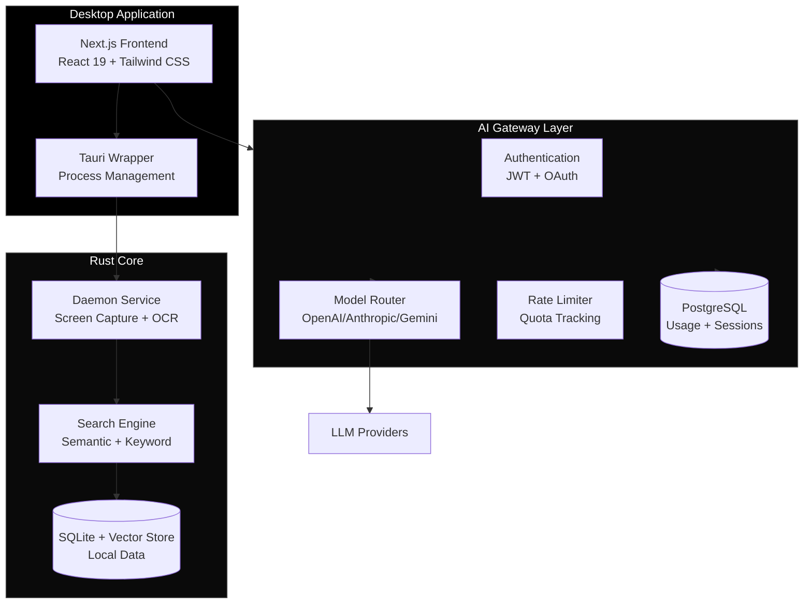
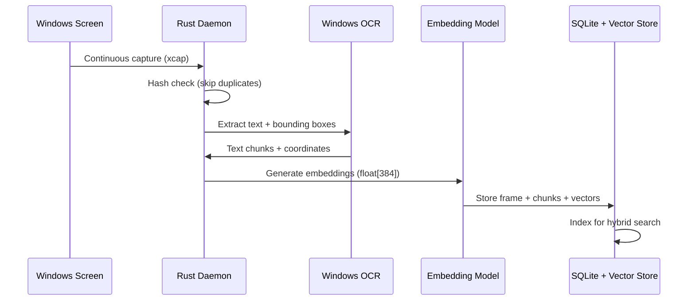
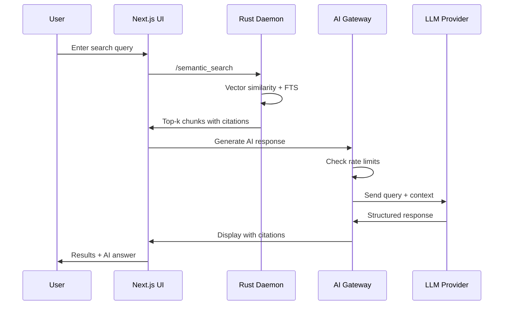
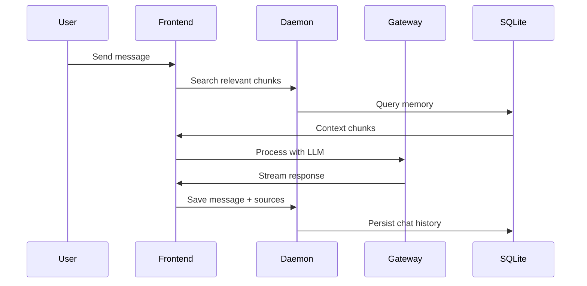

## System Architecture

Memento AI is built as a modular, local-first system with three core layers:



---

## Component Architecture

<CardGroup cols={2}>
  <Card title="Rust Daemon" icon="microchip" href="/architecture/daemon">
    24/7 background service for screen capture, OCR, and indexing.
  </Card>
  <Card title="Rust Core" icon="database" href="/architecture/rust-core">
    High-performance search engine with hybrid semantic + keyword retrieval.
  </Card>
  <Card title="AI Gateway" icon="cloud" href="/architecture/ai-gateway">
    Node.js service for auth, rate-limiting, and LLM model routing.
  </Card>
  <Card title="Frontend" icon="window" href="/architecture/frontend">
    Next.js 16 application wrapped in Tauri for desktop deployment.
  </Card>
  <Card title="Desktop App" icon="desktop" href="/architecture/desktop-app">
    Tauri wrapper managing system tray, IPC, and process orchestration.
  </Card>
  <Card title="Database Schema" icon="table" href="/architecture/database-schema">
    SQLite schema for local data and PostgreSQL for gateway state.
  </Card>
</CardGroup>

---

## Data Flow

### Screen Capture Pipeline



### Search Query Flow



### Chat Message Flow



---

## Key Design Principles

<AccordionGroup>
  <Accordion title="Privacy First" icon="lock">
    All personal data (screen captures, OCR text, embeddings) stays local on your machine. Only minimal context is sent to LLMs when explicitly requested.
    
    - **Local Storage**: SQLite database in `%APPDATA%\Memento\`
    - **No Cloud Sync**: Screen captures never leave your device
    - **Optional LLM**: AI features are opt-in and context-limited
  </Accordion>
  
  <Accordion title="Local-First Performance" icon="bolt">
    Core search operations run entirely locally using Rust for maximum performance.
    
    - **Sub-millisecond search**: Vector + keyword hybrid retrieval
    - **Efficient embeddings**: float[384] vectors with ONNX Runtime
    - **Smart caching**: Deduplicate identical frames via hash checking
  </Accordion>
  
  <Accordion title="Modular Architecture" icon="cubes">
    Each component can be swapped or disabled independently.
    
    - **Pluggable LLMs**: Switch between OpenAI, Anthropic, Gemini, or local models
    - **Optional Gateway**: Core search works without AI features
    - **Standalone Daemon**: Can run as Windows Service independently
  </Accordion>
  
  <Accordion title="Production Ready" icon="shield">
    Built for 24/7 operation with proper error handling and monitoring.
    
    - **Graceful shutdown**: Proper Windows Service control signal handling
    - **Auto-updates**: Velopack integration with delta patches
    - **Logging**: Sentry + file-based rolling logs
    - **Rate limiting**: Prevent quota abuse and manage costs
  </Accordion>
</AccordionGroup>

---

## Technology Stack

### Backend

| Component | Technology | Purpose |
|-----------|------------|----------|
| **Daemon** | Rust, Tokio | Screen capture, OCR, indexing |
| **Search** | SQLite + sqlite-vec | Hybrid vector + keyword search |
| **Embeddings** | ONNX Runtime | Local sentence transformer models |
| **Gateway** | Node.js, Express | Auth, rate limiting, model routing |
| **Gateway DB** | PostgreSQL, Drizzle | User sessions, usage tracking |

### Frontend

| Component | Technology | Purpose |
|-----------|------------|----------|
| **Framework** | Next.js 16, React 19 | Web application framework |
| **Desktop** | Tauri 2 | Native wrapper, IPC, system tray |
| **Styling** | Tailwind CSS, Radix UI | Component library and styling |
| **State** | TanStack Query | Data fetching and caching |
| **Markdown** | react-markdown, KaTeX | Render chat responses with math |

---

## File System Layout

### Windows Installation

```
%LOCALAPPDATA%\memento\           # Velopack installation
├── current\                       # Current version binaries
│   ├── memento.exe               # Tauri desktop app
│   ├── memento-daemon.exe        # Rust daemon service
│   └── service-helper.exe        # Admin installer
└── packages\                      # Update packages

%APPDATA%\Memento\                 # User data directory
├── data\                          # SQLite databases
│   └── memento.db                # Main database
├── images\                        # Screen captures (JPEG)
├── models\                        # ONNX embedding models
└── logs\                          # Application logs

%PROGRAMDATA%\memento\             # Shared system directory
└── ports\                         # Port discovery files
    ├── daemon.port               # Daemon HTTP port
    └── agents.port               # Agents HTTP port
```

---

## Next Steps

<CardGroup cols={2}>
  <Card title="Deep Dive: Daemon" icon="gear" href="/architecture/daemon">
    Learn how the screen capture and OCR pipeline works.
  </Card>
  <Card title="Deep Dive: Search" icon="magnifying-glass" href="/architecture/rust-core">
    Understand the hybrid semantic + keyword search engine.
  </Card>
  <Card title="Deep Dive: AI Gateway" icon="server" href="/architecture/ai-gateway">
    Explore authentication, rate limiting, and model routing.
  </Card>
  <Card title="Data Flow" icon="diagram-project" href="/architecture/data-flow">
    See how data flows through the entire system.
  </Card>
</CardGroup>

## Monorepo structure

```
memento-ai/
├── app/
│   ├── frontend/          Next.js UI
│   ├── agents/            LangChain agents
│   └── src-tauri/         Tauri shell config
├── ai-gateway/            Node.js Express gateway
├── crates/
│   ├── core/              Rust indexing + search library
│   ├── daemon/            Rust background service
│   └── service-helper/    Windows service helper
├── shared/                Shared TypeScript types & utils
├── migrations/            SQL schema migrations
└── mintlify/              This documentation
```

---

## Key design decisions

<AccordionGroup>
  <Accordion title="Why Rust for the core?">
    Sub-millisecond local search requires native performance. A Rust library avoids JVM or Python interpreter overhead and keeps memory usage minimal — critical for a background daemon that runs 24/7.
  </Accordion>
  <Accordion title="Why a separate AI Gateway?">
    Centralising LLM calls in a single Node.js service lets us enforce rate limits, swap providers without touching the UI, and track usage per user — all without the frontend needing API keys.
  </Accordion>
  <Accordion title="Why Tauri instead of Electron?">
    Tauri uses the OS's native WebView instead of bundling Chromium. The result is a binary 10-20× smaller than Electron and significantly lower idle memory usage.
  </Accordion>
  <Accordion title="Why hybrid search (semantic + keyword)?">
    Semantic search alone misses exact matches (filenames, code, IDs). Keyword search alone misses paraphrased queries. Fusing both with Reciprocal Rank Fusion gives the best real-world recall.
  </Accordion>
</AccordionGroup>
