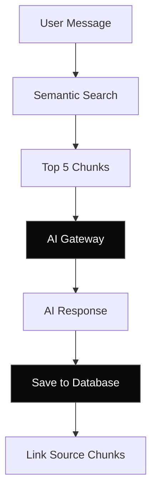

## Overview

Chat Memory allows Memento AI to maintain multi-turn conversations grounded in your screen captures. Every message is linked to source chunks, enabling transparent citations and memory retrieval.

---

## Architecture



---

## Storage Schema

```sql
CREATE TABLE chats (
    session_id TEXT PRIMARY KEY,
    title TEXT,
    pinned INTEGER,
    created_at INTEGER,
    updated_at INTEGER
);

CREATE TABLE messages (
    id INTEGER PRIMARY KEY,
    session_id TEXT,
    role TEXT,  -- 'user' | 'assistant'
    content TEXT,
    thinking_steps TEXT,  -- JSON
    created_at INTEGER
);

CREATE TABLE message_sources (
    message_id INTEGER,
    chunk_id INTEGER,
    usage_type TEXT  -- 'citation' | 'context'
);
```

---

## Chat Flow

<Steps>
  <Step title="User asks question">
    Frontend sends user message to daemon for storage.
  </Step>
  
  <Step title="Search for context">
    Daemon performs semantic search to find relevant chunks.
  </Step>
  
  <Step title="Send to AI Gateway">
    Frontend sends query + context chunks to AI Gateway for LLM processing.
  </Step>
  
  <Step title="Stream response">
    AI Gateway streams LLM response back to frontend.
  </Step>
  
  <Step title="Save with citations">
    Frontend saves assistant message linked to source chunks.
  </Step>
</Steps>

---

## Citations

Every AI response is linked to source chunks:

```typescript
interface Message {
  id: number;
  role: 'user' | 'assistant';
  content: string;
  sources: {
    chunk_id: number;
    text_content: string;
    app_name: string;
    image_path: string;
    captured_at: number;
  }[];
}
```

**UI Features**:
- Click citation to view source screenshot
- Hover to preview chunk text
- Filter by source app/time

---

## Next Steps

<CardGroup cols={2}>
  <Card title="Chat API" icon="message" href="/api-reference/chat">
    Manage chat sessions via API.
  </Card>
  <Card title="Data Flow" icon="diagram-project" href="/architecture/data-flow">
    See complete chat flow.
  </Card>
</CardGroup>
