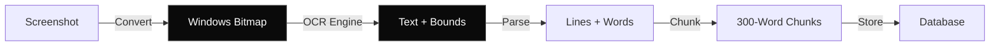

## Overview

After capturing screenshots, Memento AI uses Windows built-in OCR (Optical Character Recognition) to extract text with precise bounding boxes, enabling searchable memory of everything you've seen.

<Info>
  **Engine**: Windows.Media.Ocr.OcrEngine (built into Windows 10+)  
  **Languages**: 25+ languages supported out of the box
</Info>

---

## OCR Pipeline



---

## Text Extraction

Memento uses Windows OCR API to extract text at line and word level.

<CodeGroup>

```rust OCR Processing
use windows::Media::Ocr::OcrEngine;
use windows::Graphics::Imaging::SoftwareBitmap;

pub async fn extract_text(image: &DynamicImage) -> Result<OcrResult> {
    // Convert to Windows bitmap
    let bitmap = convert_to_software_bitmap(image)?;
    
    // Get OCR engine for current language
    let engine = OcrEngine::try_create_from_language(
        Language::English()?
    )?;
    
    // Run OCR
    let result = engine.recognize_async(&bitmap)?.await?;
    
    // Extract text and bounding boxes
    Ok(OcrResult {
        text: result.text()?.to_string(),
        lines: extract_lines_with_bounds(&result),
    })
}
```

```typescript OCR Result Structure
interface OcrResult {
  text: string;  // Full text content
  lines: OcrLine[];
}

interface OcrLine {
  text: string;
  bounds: {
    x: number;
    y: number;
    width: number;
    height: number;
  };
  confidence: number;  // 0.0 - 1.0
  words: OcrWord[];
}

interface OcrWord {
  text: string;
  bounds: Rect;
  confidence: number;
}
```

</CodeGroup>

---

## Bounding Boxes

Each text element includes precise pixel coordinates, stored as JSON.

```json
{
  "lines": [
    {
      "text": "Memento AI Documentation",
      "bounds": { "x": 120, "y": 50, "width": 380, "height": 45 },
      "confidence": 0.98,
      "words": [
        {
          "text": "Memento",
          "bounds": { "x": 120, "y": 50, "width": 120, "height": 45 },
          "confidence": 0.99
        },
        {
          "text": "AI",
          "bounds": { "x": 250, "y": 50, "width": 40, "height": 45 },
          "confidence": 0.97
        },
        {
          "text": "Documentation",
          "bounds": { "x": 300, "y": 50, "width": 200, "height": 45 },
          "confidence": 0.98
        }
      ]
    }
  ]
}
```

**Use Cases**:
- Highlight search matches on screenshots
- Click-to-select text regions
- Layout analysis for context

---

## Text Chunking

OCR text is split into overlapping chunks for better semantic search.

### Chunking Strategy

<Tabs>
  <Tab title="Parameters">
    - **Chunk Size**: 300 words
    - **Overlap**: 50 words
    - **Min Chunk**: 20 words (discard smaller)
    
    ```typescript
    const CHUNK_SIZE = 300;
    const OVERLAP = 50;
    const MIN_CHUNK_SIZE = 20;
    ```
  </Tab>
  
  <Tab title="Algorithm">
    ```rust
    pub fn chunk_text(text: &str, chunk_size: usize) -> Vec<String> {
        let words: Vec<&str> = text.split_whitespace().collect();
        let mut chunks = Vec::new();
        
        let mut i = 0;
        while i < words.len() {
            let end = (i + chunk_size).min(words.len());
            let chunk = words[i..end].join(" ");
            
            if chunk.split_whitespace().count() >= MIN_CHUNK_SIZE {
                chunks.push(chunk);
            }
            
            i += chunk_size - OVERLAP;
        }
        
        chunks
    }
    ```
  </Tab>
  
  <Tab title="Example">
    **Input** (600 words):
    ```
    Memento AI is a privacy-first desktop application...
    [600 words of text]
    ```
    
    **Output** (3 chunks):
    ```
    Chunk 1: Words 1-300
    Chunk 2: Words 251-550 (50-word overlap with Chunk 1)
    Chunk 3: Words 501-600 (50-word overlap with Chunk 2)
    ```
    
    Overlapping ensures semantic continuity across chunk boundaries.
  </Tab>
</Tabs>

---

## Language Support

Windows OCR supports 25+ languages. You can detect language automatically or specify explicitly.

### Supported Languages

| Language | Code | Status |
|----------|------|--------|
| English | `en` | ✅ Built-in |
| Spanish | `es` | ✅ Built-in |
| French | `fr` | ✅ Built-in |
| German | `de` | ✅ Built-in |
| Chinese (Simplified) | `zh-Hans` | ✅ Built-in |
| Chinese (Traditional) | `zh-Hant` | ✅ Built-in |
| Japanese | `ja` | ✅ Built-in |
| Korean | `ko` | ✅ Built-in |
| Arabic | `ar` | ⬇️ Downloadable |
| Hindi | `hi` | ⬇️ Downloadable |
| Russian | `ru` | ⬇️ Downloadable |

### Language Detection

```rust
pub async fn detect_language(image: &DynamicImage) -> Result<Language> {
    // Try OCR with language detection
    let engine = OcrEngine::try_create_from_user_profile_languages()?;
    let result = engine.recognize_async(image).await?;
    
    // Check confidence
    if result.text_angle()? == 0.0 && !result.text()?.is_empty() {
        Ok(Language::from_bcp47(&result.recognized_line(0)?.language()?))
    } else {
        Ok(Language::English())  // Fallback
    }
}
```

---

## OCR Quality

### Factors Affecting Quality

<AccordionGroup>
  <Accordion title="Image Resolution" icon="image">
    **Best**: 1920x1080 or higher  
    **Minimum**: 1280x720  
    **Poor**: Below 720p
    
    Higher resolution = better text recognition, especially for small fonts.
  </Accordion>
  
  <Accordion title="Font Size" icon="text-height">
    **Best**: 12pt+  
    **Acceptable**: 10-11pt  
    **Difficult**: <10pt
    
    Tiny text may not be recognized accurately.
  </Accordion>
  
  <Accordion title="Contrast" icon="adjust">
    **Best**: Black text on white background  
    **Good**: High contrast (dark on light or vice versa)  
    **Poor**: Low contrast (gray on gray)
    
    High contrast improves recognition accuracy.
  </Accordion>
  
  <Accordion title="Font Style" icon="font">
    **Best**: Sans-serif (Arial, Calibri, Segoe UI)  
    **Good**: Serif (Times New Roman, Georgia)  
    **Difficult**: Handwriting, decorative fonts
    
    Standard fonts work best.
  </Accordion>
  
  <Accordion title="Image Quality" icon="sparkles">
    **Best**: PNG, lossless  
    **Good**: JPEG 90%+  
    **Acceptable**: JPEG 75%  
    **Poor**: JPEG <60%
    
    Memento saves at 75% JPEG quality by default (good balance).
  </Accordion>
</AccordionGroup>

### Confidence Scores

OCR returns confidence scores for each word/line (0.0 - 1.0).

```typescript
interface OcrLine {
  text: string;
  confidence: number;  // 0.0 - 1.0
}

// Typical scores
const highConfidence = 0.95;  // Clear, high-contrast text
const mediumConfidence = 0.75;  // Readable but challenging
const lowConfidence = 0.50;  // Likely incorrect
```

<Note>
  Memento currently accepts all OCR results regardless of confidence. Future versions may filter low-confidence text.
</Note>

---

## Storage

OCR results are stored in two places:

### 1. Plain Text (Search Index)

```sql
CREATE TABLE chunks (
    id INTEGER PRIMARY KEY,
    frame_id INTEGER,
    text_content TEXT,  -- Plain text for search
    chunk_index INTEGER
);

-- Full-text search index
CREATE VIRTUAL TABLE chunks_fts USING fts5(
    chunk_id, text_content
);
```

### 2. Structured JSON (Bounding Boxes)

```sql
CREATE TABLE chunks (
    -- ...
    text_json TEXT  -- JSON with bounding boxes
);
```

```json
{
  "lines": [
    {
      "text": "Memento AI",
      "bounds": { "x": 100, "y": 50, "width": 200, "height": 40 },
      "confidence": 0.98
    }
  ]
}
```

This enables:
- **Search**: Full-text search on plain text
- **UI**: Highlight search terms on screenshots using bounds

---

## Performance

### Benchmarks

| Resolution | OCR Time | Text Length |
|------------|----------|-------------|
| 1920x1080 | ~200ms | 500-2000 words |
| 2560x1440 | ~400ms | 800-3000 words |
| 3840x2160 | ~800ms | 1200-5000 words |

**Hardware**: Intel i7-10700, 16GB RAM

<Tip>
  OCR is the slowest part of the pipeline. Consider lowering capture frequency if OCR becomes a bottleneck.
</Tip>

---

## Troubleshooting

<AccordionGroup>
  <Accordion title="Poor recognition accuracy" icon="text-slash">
    **Solutions**:
    1. Increase screen resolution
    2. Use higher DPI scaling (150-200%)
    3. Check Windows OCR language pack is installed
    4. Verify image quality in database
  </Accordion>
  
  <Accordion title="Missing text" icon="eye-slash">
    **Causes**:
    - Text too small (<10pt)
    - Low contrast
    - Handwritten or stylized fonts
    - OCR engine not detecting language correctly
    
    **Solution**: Manually specify language or increase font size.
  </Accordion>
  
  <Accordion title="Slow OCR processing" icon="hourglass">
    **Optimizations**:
    1. Reduce capture frequency
    2. Lower image capture resolution
    3. Enable adaptive throttling (enabled by default)
    4. Upgrade to faster CPU
  </Accordion>
</AccordionGroup>

---

## Next Steps

<CardGroup cols={2}>
  <Card title="Screen Capture" icon="camera" href="/core-concepts/screen-capture">
    Learn about the capture pipeline.
  </Card>
  <Card title="Semantic Search" icon="magnifying-glass" href="/core-concepts/semantic-search">
    Understand how text is embedded and searched.
  </Card>
  <Card title="Architecture" icon="diagram-project" href="/architecture/daemon">
    Deep dive into daemon architecture.
  </Card>
  <Card title="Search API" icon="code" href="/api-reference/search">
    Search extracted text via API.
  </Card>
</CardGroup>
