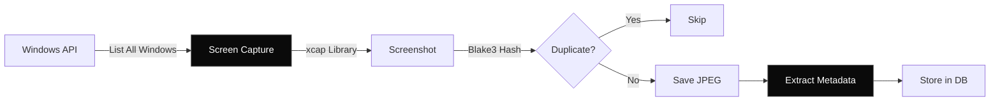

## Overview

Screen capture is the foundation of Memento AI's memory system. The daemon continuously takes screenshots of all visible windows, enabling you to search and recall everything you've ever seen.

<Info>
  **Continuous Operation**: Captures run 24/7 in the background with adaptive throttling to minimize resource usage.
</Info>

---

## How It Works



### Capture Loop

The daemon runs a continuous loop that:

1. **Enumerates Windows**: Queries Windows OS for all visible windows
2. **Filters**: Excludes hidden/minimized windows and system UI elements
3. **Captures**: Takes a screenshot of each window
4. **Deduplicates**: Computes hash to skip identical frames
5. **Stores**: Saves JPEG and metadata to database

<Tabs>
  <Tab title="Configuration">
    ```json
    {
      "capture": {
        "enabled": true,
        "interval_seconds": 2,
        "image_quality": 75,
        "min_window_size": 50
      }
    }
    ```
    
    - **interval_seconds**: Time between captures (adaptive)
    - **image_quality**: JPEG compression (1-100)
    - **min_window_size**: Minimum window size to capture (pixels)
  </Tab>
  
  <Tab title="What's Captured">
    For each window, Memento captures:
    
    - **Screen**: Screenshot (JPEG, 75% quality)
    - **App**: Application name (e.g., `chrome.exe`)
    - **Title**: Window title text
    - **Position**: X, Y coordinates
    - **Size**: Width and height
    - **URL**: Browser URL (if applicable)
    - **Timestamp**: Unix timestamp
  </Tab>
  
  <Tab title="What's Excluded">
    By default, Memento NEVER captures:
    
    - Hidden or minimized windows
    - Windows smaller than 50x50 pixels
    - System UI (taskbar, start menu, etc.)
    - Windows from [masked apps](/api-reference/privacy)
    - Browser tabs from [masked domains](/api-reference/privacy)
  </Tab>
</Tabs>

---

## Adaptive Throttling

Memento automatically adjusts capture frequency based on system state.

### Capture Intervals

| Condition | Interval | Reason |
|-----------|----------|--------|
| Normal usage | 2 seconds | Standard operation |
| High CPU (>80%) | 10 seconds | Reduce system load |
| User idle | 30 seconds | Save resources |
| Battery low | 60 seconds | Conserve power |

```rust
fn adaptive_interval(cpu_usage: f32, user_active: bool, on_battery: bool) -> Duration {
    match (cpu_usage, user_active, on_battery) {
        (high, _, _) if high > 80.0 => Duration::from_secs(10),
        (_, false, _) => Duration::from_secs(30),  // Idle
        (_, _, true) if battery_level() < 20 => Duration::from_secs(60),  // Low battery
        _ => Duration::from_secs(2),  // Normal
    }
}
```

---

## Hash Deduplication

To avoid storing duplicate frames, Memento computes a cryptographic hash of each screenshot.

<CodeGroup>

```rust Hash Calculation
use blake3::Hasher;

fn calculate_hash(image: &DynamicImage) -> String {
    let mut hasher = Hasher::new();
    hasher.update(image.as_bytes());
    hasher.finalize().to_hex().to_string()
}
```

```typescript Skip Duplicate
const currentHash = calculateHash(screenshot);

if (currentHash === previousHash) {
  // Skip: frame hasn't changed
  continue;
}

// New frame: process and store
await processFrame(screenshot);
previousHash = currentHash;
```

</CodeGroup>

This prevents:
- Duplicate storage of static screens
- Unnecessary OCR processing
- Wasted disk space

<Note>
  **Savings**: Hash deduplication typically reduces storage by 60-80% compared to capturing every frame.
</Note>

---

## Browser URL Extraction

For browser windows, Memento extracts the active URL using OS accessibility APIs.

### Supported Browsers

<Tabs>
  <Tab title="Chromium-Based">
    - Google Chrome
    - Microsoft Edge
    - Brave
    - Opera
    - Vivaldi
    
    **Method**: UIA (UI Automation) API
  </Tab>
  
  <Tab title="Firefox">
    - Mozilla Firefox
    
    **Method**: UIA (UI Automation) API
  </Tab>
  
  <Tab title="Safari">
    Not supported (macOS only)
  </Tab>
</Tabs>

```rust
pub async fn get_browser_url(window: &Window) -> Option<String> {
    let app_name = window.get_app_name()?;
    
    match app_name.as_str() {
        "chrome.exe" | "msedge.exe" | "brave.exe" => {
            get_chromium_url(window).await
        }
        "firefox.exe" => {
            get_firefox_url(window).await
        }
        _ => None
    }
}
```

---

## Storage Format

### File System

```
%APPDATA%\Memento\
└── images\
    ├── 20240324\
    │   ├── 1234.jpg
    │   ├── 1235.jpg
    │   └── ...
    ├── 20240325\
    │   └── ...
    └── ...
```

- **Daily folders**: Organized by date (YYYYMMDD)
- **JPEG format**: 75% quality (configurable)
- **Typical size**: 100-300 KB per frame

### Database

```sql
CREATE TABLE frames (
    id INTEGER PRIMARY KEY,
    captured_at INTEGER NOT NULL,
    app_name TEXT,
    window_title TEXT,
    browser_url TEXT,
    image_path TEXT NOT NULL,
    hash TEXT UNIQUE,
    window_x INTEGER,
    window_y INTEGER,
    window_width INTEGER,
    window_height INTEGER
);
```

---

## Privacy & Control

<AccordionGroup>
  <Accordion title="Pause Capture" icon="pause">
    Temporarily stop capturing:
    
    ```bash
    curl -X POST http://localhost:7070/capture/pause
    ```
    
    Or use the system tray menu.
  </Accordion>
  
  <Accordion title="Exclude Apps/Websites" icon="ban">
    Prevent specific apps or websites from being captured:
    
    ```typescript
    // Never capture banking websites
    await addMaskedItem('bank.com', 'web');
    
    // Never capture password manager
    await addMaskedItem('KeePass.exe', 'app');
    ```
    
    See [Privacy API](/api-reference/privacy) for details.
  </Accordion>
  
  <Accordion title="Auto-Cleanup" icon="broom">
    Configure automatic deletion of old frames:
    
    ```json
    {
      "capture": {
        "max_age_days": 90  // Delete frames older than 90 days
      }
    }
    ```
  </Accordion>
</AccordionGroup>

---

## Performance

### Resource Usage

| Metric | Normal | High Load |
|--------|--------|-----------|
| CPU | 2-5% | 8-12% |
| RAM | 150-300 MB | 400-600 MB |
| Disk I/O | 5-10 MB/min | 15-25 MB/min |

### Optimization Tips

<Card title="Reduce Capture Frequency" icon="clock">
  Increase `interval_seconds` for lower resource usage:
  ```json
  { "capture": { "interval_seconds": 5 } }
  ```
</Card>

<Card title="Lower Image Quality" icon="image">
  Reduce JPEG quality for smaller files:
  ```json
  { "capture": { "image_quality": 60 } }
  ```
</Card>

<Card title="Exclude Noisy Apps" icon="filter">
  Exclude rapidly changing apps (e.g., video players):
  ```typescript
  await addMaskedItem('vlc.exe', 'app');
  ```
</Card>

---

## Next Steps

<CardGroup cols={2}>
  <Card title="OCR Processing" icon="text" href="/core-concepts/ocr-processing">
    Learn how text is extracted from screenshots.
  </Card>
  <Card title="Capture API" icon="camera" href="/api-reference/capture">
    Control capture via REST API.
  </Card>
  <Card title="Privacy Setup" icon="shield" href="/getting-started/privacy-setup">
    Configure exclusion rules.
  </Card>
  <Card title="Architecture" icon="diagram-project" href="/architecture/daemon">
    Deep dive into the daemon architecture.
  </Card>
</CardGroup>
